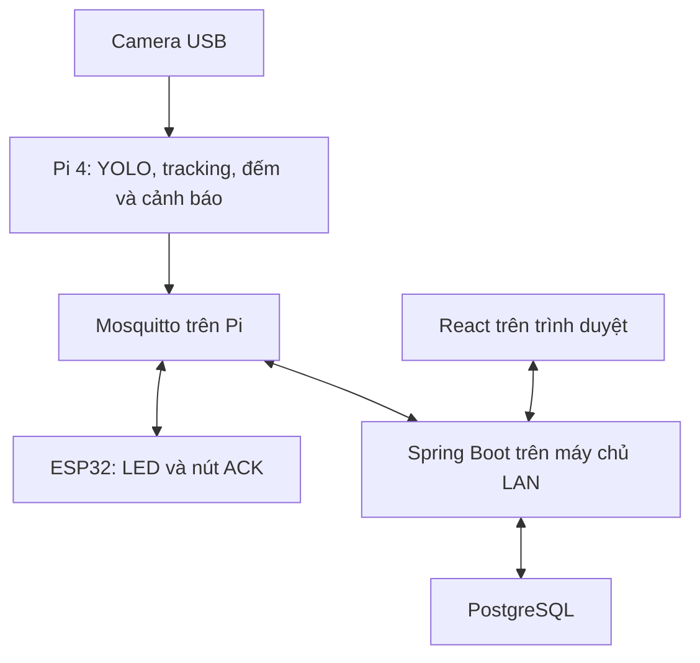

## Mục lục kế hoạch triển khai chi tiết

- 1. Bài toán và problem statement
- 1. Phạm vi và kết quả cần có
- 1. Kiến trúc hệ thống
- 1. Phần cứng và dự toán
- 1. Khảo sát, lắp camera và bố trí mô hình
- 1. Phần mềm và môi trường Windows
- 1. Cấu trúc thư mục dự án và phương án kế thừa YOLO Watchdog
- 1. Cấu hình camera và thuật toán
- 1. MQTT và cấu hình mạng
- 1. Thiết kế firmware
- 1. Dữ liệu, lưu trữ và dashboard
- 1. Thu thập dữ liệu và fine-tune
- 1. Luồng chạy và phục hồi lỗi
- 1. Yêu cầu và tiêu chí nghiệm thu
- 1. Kế hoạch 10 tuần
- 1. Kịch bản kiểm thử và demo
- 1. Thử nghiệm tại cửa hàng
- 1. Rủi ro và phương án thu gọn
- 1. Sản phẩm bàn giao và báo cáo
- 1. Việc cần làm trong 7 ngày tới
- 1. Thuật ngữ và tài liệu tham khảo
- 1. Triển khai và trình diễn bằng Raspberry Pi

Giữ số mục của bản đang triển khai để các tham chiếu kỹ thuật ổn định; mục 6 đã được người dùng bỏ, phần cạnh tranh cũ ở mục 23 đã chuyển vào 1.4.

---

## 1. Bài toán và problem statement

### 1.0 Bối cảnh và lý do hình thành đề tài

Để đánh giá hoạt động một điểm bán, người quản lý cần phân biệt ba câu hỏi: có bao nhiêu lượt người đến, hoạt động mua hàng tạo ra kết quả gì, và khu vực phục vụ có đáp ứng được nhu cầu tại từng thời điểm hay không. Ba câu hỏi liên quan nhưng không thay thế nhau. Dữ liệu hóa đơn mô tả giao dịch đã phát sinh; nếu chỉ có hóa đơn thì chưa biết đầy đủ những lượt ghé không mua hàng hoặc khách đến vào lúc nào trước khi thanh toán. Ngược lại, số người qua cửa không cho biết họ có mua hàng hay đang phải chờ tại quầy. Đây là lập luận về các loại dữ liệu cần phân biệt khi thiết kế đồ án, chưa phải kết luận từ khảo sát một cửa hàng cụ thể.

Trong phương án đề xuất, camera được dùng để tạo hai loại thông tin bổ sung: lưu lượng qua cửa theo thời gian và tình trạng hiện diện tại vùng chờ. Báo cáo lưu lượng giúp người quản lý có cơ sở xem lại cách bố trí ca; cảnh báo vùng chờ cung cấp tín hiệu để kiểm tra trong ca. Giá trị cần hướng đến là đưa số liệu vào một quyết định vận hành cụ thể, thay vì chỉ hiển thị bộ đếm hoặc bật đèn khi ảnh có nhiều người. Nhận biết giờ đông để bố trí nhân sự; kết hợp heatmap để xem phân bố khách; so sánh lưu lượng giữa các điểm bán.

### 1.1 Đồ án giải quyết việc gì, cho ai?

Người sử dụng chính là quản lý điểm bán và nhân viên có thể hỗ trợ quầy thanh toán. Một cơ sở bán lẻ có thể chưa có số liệu khách ra/vào theo giờ để tham khảo khi bố trí ca làm, trong khi nhân viên hỗ trợ ở vị trí khác không quan sát liên tục được vùng chờ. Hệ thống giải quyết hai nhu cầu liên quan: nhìn lại quy luật lưu lượng và nhận biết tình trạng cần kiểm tra ngay trong ca.

Đối tượng triển khai là điểm bán có mặt bằng phù hợp để một góc camera thấy rõ cửa và vùng chờ, có người sử dụng báo cáo và có nhân viên có thể phản hồi cảnh báo. Không giả định mọi cửa hàng nhỏ đều thường xuyên quá tải; không tuyên bố bao quát toàn bộ siêu thị lớn. Quy mô mặt bằng phù hợp và quy trình phản hồi quan trọng hơn nhãn “nhỏ/lớn”.

| Nhu cầu                               | Dữ liệu hệ thống cung cấp                                           | Quyết định hỗ trợ                                           | Giới hạn                                                      |
| ------------------------------------- | ------------------------------------------------------------------- | ----------------------------------------------------------- | ------------------------------------------------------------- |
| Biết lúc nào khách thường đến đông    | Lượt vào/ra theo giờ/ngày, thời gian dữ liệu hợp lệ                 | Tham khảo sắp ca, giờ nghỉ, thời điểm chuẩn bị người hỗ trợ | Lưu lượng không tự quy đổi thành số nhân viên cần có          |
| Phát hiện vùng chờ đông kéo dài       | Số người đủ điều kiện trong vùng, sự kiện vượt ngưỡng và thời lượng | Người nhận kiểm tra, hỗ trợ quầy hoặc báo quản lý           | Cần có người phản hồi; camera không tự mở thêm quầy           |
| Xem việc gọi hỗ trợ có được tiếp nhận | Thời điểm mở sự kiện và nhận xác nhận                               | Rà soát quy trình tiếp nhận                                 | Xác nhận không chứng minh nhân viên đã đến hoặc đã giải quyết |
| Giảm việc xem lại camera để thống kê  | Báo cáo và CSV tại chỗ                                              | Tổng hợp vận hành                                           | Độ tin cậy phụ thuộc sai số và thời gian mất dữ liệu          |

Ví dụ giả định: báo cáo nhiều ca cho thấy lưu lượng thường cao lúc 17–19 giờ; quản lý cân nhắc bố trí người hỗ trợ trong khung đó. Trong một ca, vùng chờ có ít nhất 5 người đủ điều kiện liên tục 60 giây; ESP32 ở vị trí hỗ trợ báo đỏ. Người nhận xác nhận, kiểm tra và quyết định hỗ trợ. Đây là kịch bản để thiết kế/kiểm thử, chưa phải bằng chứng tiết kiệm nhân sự hay giảm thời gian chờ.

### 1.2 Problem statement dùng trong đề cương

> Bài toán đặt ra là bổ sung dữ liệu về lưu lượng ghé thăm và tình trạng vùng chờ để hỗ trợ quản lý vận hành tại điểm bán. Số liệu giao dịch không tự mô tả toàn bộ lượt người đến, còn tổng lượt qua cửa chưa đủ phản ánh tình trạng đông người chờ thanh toán. Trong phạm vi một cửa ra/vào và một vùng chờ cùng nằm trong một góc quan sát, để đồng thời thống kê lượt vào/ra theo giờ, ngày và phát hiện vùng chờ đông vượt ngưỡng kéo dài. Báo cáo được cung cấp cho quản lý tham khảo bố trí nhân sự; cảnh báo được truyền ESP32 tại vị trí nhân viên hỗ trợ và có xác nhận tiếp nhận. Hệ thống xử lý hình ảnh tại chỗ, mặc định chỉ lưu số liệu và sự kiện, hoạt động không phụ thuộc Internet khi mạng nội bộ còn duy trì. Đồ án đánh giá độ đúng của hai chức năng khi chạy đồng thời, độ trễ, tính chính xác của báo cáo và khả năng phục hồi lỗi; lợi ích về nhân sự hoặc thời gian chờ chỉ được kết luận khi có bằng chứng thử nghiệm vận hành.

### 1.3 Vì sao dùng camera và khi nào không phù hợp?

Một camera cung cấp vị trí người để vừa xét đi qua cửa vừa xét hiện diện trong vùng chờ. Hai phép tính sử dụng chung một lần phát hiện/tracking trên mỗi frame. Cảm biến cắt tia có thể phù hợp hơn nếu chỉ cần đếm ở cửa hẹp, nhưng không trực tiếp cho biết số người đứng trong vùng chờ rộng. RFID cần người mang/quét thẻ và không tự cho biết vị trí trong hàng chờ.

Một camera là lựa chọn có điều kiện: cửa và vùng chờ phải nhìn rõ đồng thời, người xa vẫn đủ lớn để nhận diện, ít che khuất. Nếu mặt bằng không đáp ứng thì vị trí đó không phù hợp bản cơ sở.

Nếu nhân viên luôn nhìn thấy quầy và không có ai có thể hỗ trợ, giá trị cảnh báo thấp. Nếu quản lý cũng không cần báo cáo lưu lượng, cần xem lại nhu cầu ứng dụng. Khảo sát thực địa dùng để kiểm chứng tính cần thiết, không chỉ để chọn chỗ lắp thiết bị.

### 1.4 Sản phẩm cạnh tranh, hạn chế và điểm khác biệt của đề tài

#### 1.4.1 Đề tài đang đứng ở đâu trên thị trường?

RetailVision thuộc nhóm **đếm người, phân tích lưu lượng và giám sát vùng chờ cho bán lẻ**. Thị trường đã có sản phẩm thương mại giải quyết các chức năng này. Vì vậy, mục tiêu phù hợp của đồ án là thiết kế và kiểm chứng một cấu hình nhỏ, có thể tự điều chỉnh và tận dụng thiết bị sẵn có; chưa phải chứng minh vượt mọi sản phẩm thương mại.

Khảo sát dưới đây dựa trên trang sản phẩm “Đang có trên thị trường” ở đây nghĩa là hãng đang giới thiệu dòng sản phẩm/giải pháp trên website; chưa xác nhận hàng tồn, báo giá hoặc dịch vụ triển khai tại Việt Nam. Các tính năng do hãng công bố chưa được kiểm thử độc lập trong đồ án.

Phân biệt ba mức bằng chứng: **đã xác nhận trong tài liệu hãng**, **nhận định về độ phù hợp với phạm vi đồ án**, và **lợi thế dự kiến cần đo kiểm**. Không suy rằng một tính năng không xuất hiện trên trang web thì sản phẩm chắc chắn không hỗ trợ.

#### 1.4.2 Ba đối thủ/giải pháp tham chiếu trực tiếp

<table class="markdown-table">
  <tr><th>Sản phẩm/giải pháp</th><th>Phần cạnh tranh trực tiếp</th><th>Điều kiện hoặc hạn chế cần cân nhắc</th><th>Cơ hội của RetailVision</th></tr>
  <tr><td>AXIS Object Analytics trên camera Axis tương thích</td><td>Đếm qua vạch, số người trong vùng, xử lý trên camera</td><td>Cần camera và chức năng tương thích; không phải ứng dụng cài cho webcam USB bất kỳ. Trang sản phẩm</td><td>Tận dụng webcam/PC đang có; tự sửa thuật toán và giao thức ứng dụng</td></tr>
  <tr><td>V-Count Nano AI + BoostBI</td><td>Cảm biến đếm người và phân tích vùng chờ; dashboard bán lẻ</td><td>Cấu hình phần cứng, tính năng và gói phần mềm cần chọn đúng nhu cầu. Nano AI</td><td>Thiết kế một luồng cảnh báo local hẹp, dữ liệu lưu tại chỗ, dễ kiểm tra từng module</td></tr>
  <tr><td>Xovis PC2SE và giải pháp retail qua hệ sinh thái đối tác</td><td>Cảm biến stereo 3D, đếm lưu lượng và phân tích hành vi trong cửa hàng</td><td>Dùng cảm biến chuyên dụng, yêu cầu bố trí và tích hợp tương ứng. PC2-series</td><td>Thử nghiệm bằng thiết bị phổ thông khi đã có máy tính; không cần triển khai đa cảm biến ở bản đầu</td></tr>
</table>

#### 1.4.3 Nhược điểm tương đối của từng phương án so với phạm vi đề tài

##### A. AXIS Object Analytics: ràng buộc camera, nhưng là đối thủ chức năng rất gần

**Điểm đã xác nhận:** ứng dụng được cài sẵn không tính thêm phí trên camera Axis tương thích và xử lý tại camera. Không nên viết rằng dùng nó luôn phải trả thêm phí analytics hoặc cần máy chủ xử lý video riêng. [Axis — thông tin sản phẩm](https://www.axis.com/products/axis-object-analytics)

**Hạn chế trong hoàn cảnh của bạn:** nếu hiện chỉ có webcam USB và laptop, bạn không thể dùng trực tiếp AXIS Object Analytics trên hai thiết bị đó. Phải chọn camera Axis phù hợp. Suy ra, RetailVision có thể thuận tiện hơn để tận dụng phần cứng đang sở hữu và thực hiện các thí nghiệm thay model, logic đếm hay định dạng bản tin. Đây là lợi thế về khả năng tự phát triển, chưa phải bằng chứng tổng chi phí thấp hơn.

**Điểm cần thừa nhận:** Axis đã có hướng dẫn kích hoạt đèn/còi mạng qua MQTT khi số người trong vùng vượt ngưỡng trong một thời gian xác định. Do đó, “đếm người → MQTT → bật đèn” không phải chức năng mới độc quyền của đề tài. [Hướng dẫn AXIS Object Analytics](https://help.axis.com/en-us/axis-object-analytics)

**Cập nhật tên sản phẩm:** AXIS People Counter đã được hãng chỉ định thay thế bằng AXIS Object Analytics; nên dùng tên sản phẩm hiện tại khi phân tích đối thủ. [Trang hỗ trợ AXIS People Counter](https://www.axis.com/products/axis-people-counter/support)

##### B. V-Count Nano AI + BoostBI: nền tảng nhiều tính năng, cần xem đúng gói và nhịp cập nhật

**Điểm đã xác nhận:** Nano AI xử lý dữ liệu độ sâu trên thiết bị; vì vậy không có cơ sở nói sản phẩm phải đưa toàn bộ video lên cloud để phát hiện người. [V-Count Nano AI](https://v-count.com/nano-ai-people-counting-sensor/)

BoostBI công bố nhịp cập nhật báo cáo thường là **10 phút**, có thể **1 phút** khi bật cập nhật realtime. Quyền API và queue analytics thuộc các lựa chọn sublicence trong gói báo giá. Đây là nhịp báo cáo, không phải thời gian suy luận của cảm biến hay độ trễ mọi kênh cảnh báo. [BoostBI — capability matrix và API access](https://v-count.com/boostbi-retail-visitor-analytics-footfall-analytics-software-shopper-analytics-platform/)

**Hạn chế trong hoàn cảnh của bạn:** nếu mục tiêu chính là đèn phản ứng theo trạng thái cập nhật khoảng mỗi giây và lưu số liệu hoàn toàn tại chỗ, cần hỏi hãng về đường dữ liệu local, cơ chế cảnh báo, quyền API và chi phí gói tương ứng. Không thể dùng nhịp dashboard trên để kết luận toàn bộ V-Count cảnh báo chậm hơn đồ án.

**Cơ hội của RetailVision:** giao thức MQTT, chu kỳ trạng thái, DB và quy trình xác nhận do người làm đồ án kiểm soát. Có thể thiết kế chính xác một nghiệp vụ quầy nhỏ. Đây là lựa chọn kiến trúc của đề tài, không phải kết luận V-Count không tích hợp được. Những phần như phân tích bán hàng, nhiều cửa hàng và app quản lý từ xa nằm ngoài phạm vi MVP này.

##### C. Xovis PC2SE: phần cứng chuyên dụng và yêu cầu lắp đặt

**Điểm đã xác nhận:** PC2SE thuộc dòng stereo 3D, hỗ trợ PoE; hãng nêu dải độ cao lắp của PC2SE/PC2RE là **1,95–6 m**. [Thông số PC2-series](https://www.xovis.com/technology/sensor/pc2-series)

**Hạn chế trong hoàn cảnh của bạn:** cần cảm biến phù hợp, nguồn/mạng và giá lắp tương ứng; bộ webcam USB đang dùng không thay thế được thiết bị này trong giải pháp Xovis. Với mô hình một quầy và thiết bị sẵn có, tự làm bằng webcam có thể giảm số hạng mục phải mua. Đó là suy luận về cấu hình đầu tư ban đầu, không phải báo giá so sánh đã xác minh. Webcam của đồ án vẫn cần góc lắp ổn định, không được coi là lắp tùy ý.

**Điểm cần thừa nhận:** giải pháp retail của Xovis có đếm người, dwell time và khả năng phối hợp nhiều cảm biến. [Xovis Retail](https://www.xovis.com/solutions/retail) Hãng cũng mô tả xử lý nhúng và xuất metadata, nên xử lý biên và hạn chế truyền hình ảnh không phải điểm khác biệt riêng của RetailVision. [Xovis Sensors](https://www.xovis.com/technology/sensor)

#### 1.4.4 Đâu là lợi thế có thể bảo vệ được của đề tài?

<table class="markdown-table">
  <tr><th>Lợi thế dự kiến</th><th>Điều kiện để đúng</th><th>Bằng chứng cần bổ sung</th></tr>
  <tr><td>Tận dụng webcam/PC sẵn có</td><td>Thiết bị thực tế đạt yêu cầu độ đúng và độ trễ</td><td>Danh sách thiết bị đang có, hóa đơn phần mua mới, benchmark</td></tr>
  <tr><td>Tùy chỉnh logic nghiệp vụ</td><td>Tự xây dựng và hiểu code đếm, dwell, hysteresis, timeout, ack</td><td>Demo thay đổi yêu cầu và bộ test tương ứng</td></tr>
  <tr><td>Chủ động lưu dữ liệu local</td><td>DB, broker và dashboard đều chạy tại chỗ như thiết kế</td><td>Kiểm tra luồng dữ liệu và thử mất Internet</td></tr>
  <tr><td>Dễ nghiên cứu và giải thích từng khâu</td><td>Có log và ranh giới module rõ</td><td>Phân tích một ca lỗi từ camera đến LED</td></tr>
  <tr><td>Phạm vi một cửa và một vùng chờ</td><td>Thống kê lưu lượng theo giờ và hỗ trợ phản hồi tại quầy trong cùng góc camera</td><td>Phỏng vấn người dùng báo cáo, pilot có người tiếp nhận và kiểm thử đồng thời</td></tr>
</table>

“Tùy chỉnh” ở đây là tự sửa mã nguồn ứng dụng do mình xây dựng, không chỉ đổi một ngưỡng trên giao diện. Không đồng nghĩa các hãng không có API hay tùy chọn cấu hình. Việc dùng mô hình/thư viện có sẵn vẫn phải theo giấy phép của chúng.

Không dùng các câu sau làm kết luận cạnh tranh khi chưa có bằng chứng: “chính xác hơn sản phẩm thương mại”, “rẻ hơn 80%”, “các hãng đều phụ thuộc cloud”, “chỉ đề tài này có MQTT”, “bảo mật tốt hơn tuyệt đối” hoặc “cài đơn giản hơn”. Các nguồn đã kiểm tra cho thấy ít nhất một số nhận định đó không đúng hoặc chưa đủ căn cứ.

#### 1.4.5 Nhược điểm hiện tại của RetailVision cần ghi nhận

Đây vẫn là thiết kế cần triển khai. Camera RGB một góc nhìn còn nhạy với che khuất và ánh sáng; tracking có thể đổi ID. Máy edge, nay chọn Raspberry Pi, phải được duy trì nguồn, tiến trình và cập nhật. Chưa có số đo độ tin cậy dài hạn, dịch vụ bảo hành, quản lý nhiều cửa hàng hoặc phân quyền hoàn chỉnh. Khi phải mua Pi cùng phụ kiện và thuê người bảo trì, lợi thế chi phí linh kiện có thể giảm đáng kể. Các so sánh tận dụng PC tại mục 1.4 phải được tính lại cho BOM Pi ở mục 24.

Nếu cửa hàng đã có camera Axis tương thích, hoặc cần sản phẩm được nhà cung cấp chịu trách nhiệm vận hành ngay, tự phát triển chưa chắc là lựa chọn kinh tế hơn. Nếu mục tiêu là đồ án và pilot một quầy với máy sẵn có, quyền chủ động thử nghiệm của RetailVision có giá trị rõ hơn.

#### 1.4.6 Cách chứng minh khả năng cạnh tranh thay vì chỉ so tính năng

So sánh các phương án theo cùng một nhu cầu: một cửa ra/vào và một vùng chờ, báo cáo lưu lượng theo giờ, phạm vi quan sát tương đương, giờ chạy/ngày giống nhau, cùng yêu cầu lịch sử và cảnh báo ở vị trí hỗ trợ.

<table class="markdown-table">
  <tr><th>Nội dung cần hỏi/đo</th><th>Cách thực hiện</th></tr>
  <tr><td>Tổng chi phí 12 tháng</td><td>Phần cứng + giấy phép/dịch vụ + lắp đặt + điện + công cấu hình/bảo trì</td></tr>
  <tr><td>Tận dụng tài sản</td><td>Lập hai bảng: đã có PC/camera và phải mua mới toàn bộ</td></tr>
  <tr><td>Hoạt động khi mất Internet</td><td>Kiểm tra riêng cảm biến, local alert, dashboard và lịch sử; không gộp thành một nhãn “offline”</td></tr>
  <tr><td>Độ đúng</td><td>Test cùng địa điểm và định nghĩa lượt/vùng/sự kiện; không so MAE của mình với phần trăm quảng cáo khác định nghĩa</td></tr>
  <tr><td>Độ trễ</td><td>Đo tách thời gian dwell/hold, xử lý, truyền tin và bật LED</td></tr>
  <tr><td>Khả năng tích hợp</td><td>Thử xuất dữ liệu, đổi ngưỡng, điều khiển đèn và phục hồi mất kết nối</td></tr>
  <tr><td>Chi phí thay đổi yêu cầu</td><td>Ghi số giờ thực hiện một thay đổi nghiệp vụ cụ thể</td></tr>
</table>

Hiện chưa có báo giá cùng cấu hình và chưa mượn được các sản phẩm để đối chứng, nên kết luận đúng mức là **lợi thế dự kiến**, không phải đã thắng đối thủ về giá/độ chính xác. Mức dự trù tại mục 4 chỉ là chi phí bổ sung khi tận dụng PC/router, không phải tổng chi phí thương mại của một hệ thống hoàn chỉnh.

#### 1.4.7 Đoạn lập luận có thể dùng trong báo cáo hoặc bảo vệ

> Thị trường đã có các giải pháp đếm người và giám sát vùng như AXIS Object Analytics, V-Count Nano AI kết hợp BoostBI và hệ thống Xovis. Vì vậy, đề tài không đặt tính mới ở việc lần đầu sử dụng camera hoặc xử lý tại biên để đếm người. Đề tài tập trung xây dựng và đánh giá một cấu hình cho một cửa và một vùng chờ trong cùng góc camera nhìn chéo, dùng Pi 4 4 GB và webcam phổ thông, thống kê lưu lượng và chủ động điều chỉnh logic gọi hỗ trợ và kết nối thiết bị IoT. Giá trị cần chứng minh là mức đáp ứng yêu cầu trong điều kiện triển khai cụ thể, khả năng hoạt động khi mất Internet và chi phí đầy đủ. Các lợi thế về độ chính xác, độ ổn định và kinh tế chỉ được kết luận sau thực nghiệm và đối chiếu phù hợp.

Các sản phẩm được nêu trong đoạn trên có nguồn tại mục 1.4.2–1.4.3. Phần định vị RetailVision là đề xuất của tài liệu này. Khi giảng viên hỏi “đã có sản phẩm rồi, tại sao vẫn làm?”, trọng tâm trả lời là **phạm vi ứng dụng, năng lực tự thiết kế và bằng chứng kiểm chứng hệ thống**, thay vì tuyên bố công nghệ hoàn toàn mới.

### 1.5 Định nghĩa đúng số liệu và đóng góp

- **Footfall trong đồ án:** lượt người qua vạch theo chiều vào; lượt ra báo riêng. Không phải khách duy nhất, người mua hàng hay số hóa đơn. Bản cơ sở có thể tính cả nhân viên/người quay lại; không nhận dạng để loại họ tự động.
- **Số người vùng chờ:** người có điểm đại diện trong đa giác và đủ thời gian hiện diện tối thiểu. Đây là đại lượng thay thế để phát hiện khả năng ùn khách, không chứng minh ý định xếp hàng.
- **OVERLOAD:** tên trạng thái kỹ thuật cho vùng chờ đông vượt ngưỡng đủ lâu; không phải kết luận cửa hàng vượt sức chứa hoặc mất an toàn.
- **Thời gian vùng chờ đông:** thời lượng sự kiện, không phải thời gian chờ từng khách. Xác nhận cảnh báo không phải hoàn tất hỗ trợ.
- **Đóng góp đồ án:** thiết kế, tích hợp và kiểm chứng một hệ thống CV–IoT trên máy tính nhúng, có dữ liệu lịch sử, phản hồi của nhân viên, offline và xử lý lỗi; không phát minh YOLO/ByteTrack.

Hệ thống hỗ trợ con người ra quyết định, không tự tính lịch nhân sự tối ưu.

**Cách chọn lọc cho RetailVision — đề xuất thiết kế của đồ án:**

| Hướng ứng dụng                          | Mức đưa vào đồ án                                                       | Dữ liệu/điều kiện còn cần                                                           |
| --------------------------------------- | ----------------------------------------------------------------------- | ----------------------------------------------------------------------------------- |
| Tham khảo bố trí nhân sự theo khung giờ | Mục tiêu chính: cung cấp báo cáo, quản lý quyết định                    | Nhiều ca có dữ liệu hợp lệ; đối chiếu lịch nhân sự và loại công việc                |
| So sánh các ngày có hoạt động quảng bá  | Có thể dùng CSV hiện có để phân tích mô tả, không thêm module marketing | Ghi ngày diễn ra hoạt động và các khác biệt giữa ca; chưa kết luận quan hệ nhân quả |
| Phân tích vị trí hàng hóa               | Hướng phát triển, không nghiệm thu trong bản cơ sở                      | Cần quan sát các khu trưng bày, không suy từ camera chỉ thấy cửa/quầy               |
| So sánh nhiều chi nhánh                 | Hướng phát triển                                                        | Nhiều địa điểm, cùng định nghĩa số đo và điều kiện so sánh                          |
| Gọi hỗ trợ khi vùng chờ đông kéo dài    | Mục tiêu chính bổ sung của RetailVision                                 | Vùng chờ nhìn rõ, ngưỡng phù hợp, người nhận có khả năng hỗ trợ                     |

### 1.6 Từ số liệu đến quyết định: ba tình huống cần phân biệt

**Tình huống A — lưu lượng tăng nhưng vùng chờ vẫn bình thường.** Người quản lý thấy nhiều lượt vào hơn trong một khung giờ, nhưng chưa có sự kiện đông vùng chờ. Hệ thống tiếp tục thống kê, không gọi hỗ trợ chỉ vì lượt vào cao. Dữ liệu này có thể được xem cùng lịch ca để chuẩn bị cho những ngày tương tự. Việc có cần tăng nhân sự hay không còn phụ thuộc công việc thực tế, không thể suy từ bộ đếm một mình.

**Tình huống B — lưu lượng không cao nhưng vùng chờ đông kéo dài.** Một giao dịch mất nhiều thời gian hoặc nhiều khách tới quầy gần nhau có thể là giả thuyết cần kiểm tra. Hệ thống chỉ nhận biết trạng thái vùng quan sát; không tự kết luận nguyên nhân. Nó gửi yêu cầu kiểm tra tới nhân viên hỗ trợ, ghi thời điểm tiếp nhận và thời điểm vùng chờ trở lại bình thường. Tình huống này giải thích vì sao cần đo tại quầy dù đã có bộ đếm cửa.

**Tình huống C — sự kiện đông lặp lại ở cùng khung giờ qua nhiều ca.** Báo cáo đặt cạnh nhau lượt vào, số phút vùng chờ đông và lịch sử tiếp nhận để quản lý xem có cần đổi thời điểm nghỉ hoặc bố trí người sẵn sàng hỗ trợ hay không. Nếu phần lớn thời gian camera bị mất dữ liệu, không dùng báo cáo đó để khẳng định quầy ít khách. Nếu nhân viên đã xác nhận nhưng chưa thể hỗ trợ, cần ghi nhận bằng quan sát/trao đổi; nút nhấn không đại diện cho việc vấn đề đã được giải quyết.

Ba tình huống cho thấy hai đầu ra có vai trò khác nhau: lưu lượng phục vụ việc xem xét kế hoạch, còn vùng chờ phục vụ việc kiểm tra và phản hồi tại thời điểm xảy ra sự kiện. Không cần cửa hàng liên tục quá tải mới có lý do thu thập lưu lượng; nhưng cần người sử dụng số liệu và hành động tiếp theo rõ ràng.

### 1.7 Tính cần thiết, tính khả thi và ý nghĩa của đề tài

**Tính cần thiết cần kiểm chứng:** khi điểm bán thiếu báo cáo lượt ghé và nhân viên hỗ trợ không nhìn trực tiếp vùng chờ, hệ thống có thể bổ sung thông tin cho hai nhóm người dùng. Khảo sát phải xác nhận khoảng thiếu thông tin này. Nếu cửa hàng đã có số liệu phù hợp, luôn có người quan sát và không có hành động nào thay đổi sau thông báo thì lý do triển khai bổ sung sẽ yếu.

**Tính khả thi trong phạm vi đã chọn:** một camera có thể cung cấp cùng kết quả phát hiện người cho vạch cửa và đa giác vùng chờ, giúp tránh nhân đôi pipeline suy luận. Điều kiện tiên quyết là mặt bằng cho phép nhìn rõ cả hai khu vực và Pi đáp ứng độ đúng/độ trễ trong thực nghiệm.

**Ý nghĩa đối với chuyên ngành hệ thống IoT:** đồ án bao gồm thu nhận dữ liệu, xử lý tại máy tính nhúng, truyền sự kiện qua mạng, thiết bị nhận cảnh báo ở vị trí khác, phản hồi của con người và lưu trữ lịch sử. Phần cần bảo vệ không chỉ là nhận diện đúng một người trong ảnh mà là toàn bộ luồng hoạt động có kiểm soát: tín hiệu còn mới hay đã lỗi, cảnh báo đến đúng nơi hay chưa, phản hồi có gắn đúng sự kiện không, dữ liệu có tổng hợp đúng qua giờ và sau restart không.

**Ý nghĩa thực tiễn có thể đánh giá:** cung cấp được báo cáo dùng được, phát hiện đúng sự kiện và thông báo tới người nhận trong phạm vi đo. Mức giảm thời gian chờ, chi phí lao động hoặc tăng doanh thu là câu hỏi đánh giá tiếp theo.

### 1.8 Câu hỏi khảo sát để kiểm chứng problem statement

| Câu hỏi cần hỏi/quan sát                                                     | Tác dụng đối với quyết định triển khai                         |
| ---------------------------------------------------------------------------- | -------------------------------------------------------------- |
| Hiện quản lý biết giờ đông bằng cách nào? Có số lượt ghé hay chỉ có hóa đơn? | Xác định báo cáo footfall có bổ sung thông tin cần thiết không |
| Quyết định nào có thể thay đổi khi xem báo cáo theo giờ?                     | Tránh xây dashboard mà không có mục đích sử dụng               |
| Vùng chờ từng đông kéo dài chưa, xảy ra khi nào, hiện ai phát hiện?          | Kiểm chứng nhu cầu cảnh báo và chọn ca khảo sát                |
| Người nhận đang ở đâu, có thể tới hỗ trợ công việc gì?                       | Xác định vị trí ESP32 và hành động sau thông báo               |
| Một camera có thấy rõ cả cửa và vùng khách đứng chờ không?                   | Kiểm tra điều kiện bắt buộc của mặt bằng                       |
| Khi nào nhân viên coi cảnh báo là hữu ích hoặc gây phiền?                    | Chọn ngưỡng/dwell/hold trên validation và đánh giá báo nhầm    |

## 2. Phạm vi và kết quả cần có

### 2.1 Phạm vi phiên bản tối thiểu đã chốt

- Một điểm bán/mô hình mặt bằng, một cửa ra/vào, một vùng chờ trước một quầy thanh toán.
- Một camera USB cố định bên trong, nhìn chéo xuống vừa phải; cả vạch đếm và vùng chờ đều nhìn rõ trong cùng khung hình.
- Một Raspberry Pi chạy một pipeline thu ảnh → YOLOv8n + tracking → hai nhánh logic đếm cửa/vùng chờ. Hai nhánh hoạt động đồng thời, không luân phiên quay camera.
- Thống kê lượt vào/ra theo giờ/ngày, hiển thị thời gian có dữ liệu và khoảng mất dữ liệu.
- Cảnh báo đông kéo dài trong vùng chờ; một ESP32 với LED/nút đặt ở vị trí nhân viên hỗ trợ khác vị trí quầy.
- Web React có lịch sử/cấu hình/CSV qua Spring Boot; Mosquitto ở Pi, PostgreSQL ở máy chủ LAN.
- Xử lý ảnh tại chỗ, không lưu/truyền video ở chế độ vận hành; debug và video nghiên cứu tách riêng.
- Kiểm thử đồng thời cửa và vùng chờ, sai số theo từng khu vực, hiệu năng Pi, offline và phục hồi lỗi.

### 2.3 Kết quả có thể trình diễn

Người đi qua cửa làm lượt vào/ra thay đổi trong khi vùng chờ vẫn được giám sát. Dashboard có báo cáo theo giờ từ dữ liệu thật. Khi ít nhất 5 người đủ dwell hiện diện trong vùng chờ liên tục 60 giây, tạo một sự kiện và bật đèn đỏ ở vị trí hỗ trợ. Nhấn nút ghi nhận tiếp nhận; đèn đỏ vẫn giữ cho tới khi không quá 3 người liên tục 10 giây. Mất camera/phân tích hết hạn cho trạng thái UNKNOWN, không báo 0 người. Mất Internet không dừng lõi khi LAN còn hoạt động.

### 2.4 Hồ sơ tham số thử nghiệm và demo

| Tham số                              | Profile thử nghiệm ban đầu | Profile demo rút ngắn |
| ------------------------------------ | -------------------------- | --------------------- |
| Người đủ điều kiện vùng chờ: dwell   | 2 giây                     | 2 giây                |
| Ngưỡng bật `on_count`                | 5 người                    | 2 người               |
| Thời gian giữ bật `on_hold_seconds`  | 60 giây                    | 10 giây               |
| Ngưỡng tắt `off_count`               | 3 người                    | 1 người               |
| Thời gian giữ tắt `off_hold_seconds` | 10 giây                    | 5 giây                |

Các giá trị này là đề xuất để bắt đầu. Dùng profile thử nghiệm cho các bảng test mặc định; profile demo chỉ phục vụ buổi bảo vệ ít người. Dashboard và báo cáo phải hiện tên profile/config_version. Chọn ngưỡng cuối trên validation theo vùng chờ thực tế; không trộn kết quả hai profile. 60 giây nhằm mô tả đông kéo dài, không khẳng định mọi quầy phải chờ đủ 60 giây mới gọi hỗ trợ.

## 3. Kiến trúc hệ thống



Pi xử lý ảnh và quyết định trạng thái cục bộ. Mosquitto đặt trên Pi để đường cảnh báo Pi → ESP32 vẫn hoạt động khi máy chạy web tạm tắt. Máy chủ LAN chạy Spring Boot, PostgreSQL và React; trong buổi demo laptop có thể làm máy chủ đó. Spring Boot subscribe MQTT, ghi dữ liệu có khóa chống trùng và cung cấp API; React chỉ gọi backend. Pi lưu tạm **sự kiện metadata chưa được backend xác nhận** trong spool JSONL có giới hạn dung lượng, gửi bù theo `event_id` hoặc `(session_id, seq)` khi backend nối lại. MQTT QoS 1 không bảo đảm backend đã commit DB; cần ACK lưu trữ ở cấp ứng dụng mới xóa spool. Không lưu video trong spool.

| Thiết bị                            | Khi mọi thứ hoạt động                             | Khi máy chủ web tắt                                                             |
| ----------------------------------- | ------------------------------------------------- | ------------------------------------------------------------------------------- |
| Pi + camera                         | Suy luận, đếm, quyết định cảnh báo, gửi MQTT      | Tiếp tục xử lý; lưu tạm metadata cần đồng bộ và báo quá giới hạn bộ đệm nếu đầy |
| ESP32                               | Nhận trạng thái, LED, gửi ACK về Pi               | Vẫn cảnh báo/ACK qua Mosquitto trên Pi khi LAN Pi–ESP32 còn                     |
| Máy chủ Spring + PostgreSQL + React | Lưu lịch sử, API, phân quyền, biểu đồ và cấu hình | Web và báo cáo không truy cập được; đồng bộ lại sau khi bật máy chủ             |

Mất Internet khác mất mạng LAN; mất broker/Pi hoặc Wi-Fi ESP32 sẽ khiến nút chuyển trạng thái cảnh báo mất liên lạc. Tắt laptop để chứng minh **cảnh báo tại biên**, không tuyên bố web và PostgreSQL vẫn hoạt động trong lúc laptop tắt. Nếu cần web hoạt động 24/7, chuyển máy chủ sang thiết bị luôn bật ở cùng LAN mà vẫn giữ Pi là máy edge.

## 4. Phần cứng và dự toán

### 4.1 Cấu hình học và phần cứng dùng chung

Bảng này phục vụ giai đoạn phát triển trên Windows.

| Thiết bị                                                              | Số lượng | Tiêu chí chọn                                                              | Vai trò                                           |
| --------------------------------------------------------------------- | -------- | -------------------------------------------------------------------------- | ------------------------------------------------- |
| Laptop/PC Windows đang có                                             | 1        | Python, JDK, Node và PostgreSQL tương thích; RAM cần đo khi chạy đồng thời | Phát triển; máy chủ backend/database/web lúc demo |
| Webcam USB UVC                                                        | 1        | Có thể mở bằng OpenCV; 720p trở lên để khảo sát, góc nhìn phù hợp          | Camera cố định                                    |
| ESP32-DevKitC V4, module WROOM-32E hoặc board ESP32-WROOM tương đương | 1        | Biết chính xác sơ đồ chân; Wi-Fi 2,4 GHz; USB nạp code                     | Thiết bị cảnh báo                                 |
| LED đỏ, xanh lá, vàng                                                 | 3        | LED chỉ thị dòng thấp                                                      | Biểu diễn trạng thái                              |
| Điện trở 330 Ω                                                        | 3        | Một điện trở riêng cho mỗi LED                                             | Hạn dòng                                          |
| Nút nhấn thường hở                                                    | 1        | Loại phù hợp breadboard                                                    | Xác nhận cảnh báo                                 |
| Breadboard, dây jumper                                                | 1 bộ     | Đấu chắc; kiểm tra tiếp xúc                                                | Mô hình ban đầu                                   |
| Cáp USB dữ liệu cho ESP32                                             | 1        | Đúng cổng của board, có truyền dữ liệu                                     | Nạp và cấp nguồn                                  |
| Router/AP 2,4 GHz                                                     | 1        | Cho các thiết bị LAN liên lạc; có DHCP reservation                         | Mạng tại chỗ                                      |
| Giá giữ camera, hộp mạch, vật tư cố định                              | 1 bộ     | Không rung; dây không vướng lối đi                                         | Lắp đặt                                           |

### 4.3 Thiết bị triển khai đã chọn

Chọn Raspberry Pi 4 4 GB làm thiết bị xử lý tại biên; hệ thống web/database chạy trên máy chủ LAN. Giữ bản Windows làm công cụ phát triển và phương án debug. Đo lại toàn luồng trên Pi; không lấy FPS laptop làm kết quả của Pi. Nếu Pi chưa đạt, tối ưu CPU và rà lại phạm vi có bằng chứng theo mục 24.9

## 5. Khảo sát, lắp camera và bố trí mô hình

### 5.2 Chọn vị trí và góc nhìn bằng ảnh thử

1. Dùng điện thoại quay thử từ vị trí dự kiến để khảo sát bố cục, sau đó xác nhận lại bằng đúng webcam. Góc rộng/chất lượng điện thoại không đại diện cho webcam.
2. Cố định camera cao hơn tầm hoạt động thông thường,Ghi số đo thực tế vào biên bản lắp.
3. Bảo đảm thấy người trước và sau khi qua vạch, đồng thời thấy phần người/điểm đại diện cần dùng trong vùng chờ. Tránh mép ảnh, cửa mở che người, ngược sáng và biển quảng cáo chắn tầm nhìn.
4. Vạch đếm đặt ở đoạn cửa ít người đứng lâu; vùng chờ đặt trước quầy, loại vị trí thu ngân và lối đi ngang bằng bố trí vật lý nếu có thể. Hai khu vực nghiệp vụ nên tách rõ để hàng chờ không tràn lên vạch.
5. Thử người gần và xa, đi sát nhau/ngược chiều, người có xe đẩy, người đi ngang và thu ngân đứng đúng vị trí. Không chỉ thử một người đứng giữa ảnh.
6. So kết quả ở kích thước model 320 và 416; thêm 640 nếu cần đối chứng. Người ở quầy có thể rõ trên ảnh gốc nhưng quá nhỏ sau resize. Không chốt góc lắp dựa vào preview lớn trên màn hình.
7. Khóa giá đỡ, lưu ảnh hiệu chuẩn có vạch/vùng và thông số camera. Nếu dịch camera, đổi tỷ lệ khung hình, crop hoặc lật ảnh thì phải hiệu chuẩn và test lại.

Nguồn ảnh khảo sát đề xuất 1280×720 nếu webcam hỗ trợ. Đây khác kích thước đầu vào model. Đọc `frame.shape` để kiểm tra camera thực sự trả về; mọi phép resize/letterbox phải quy đổi tọa độ về ảnh gốc. Nguồn 640×480 chỉ là phương án benchmark giảm tải có kiểm thử lại hai vùng, không mặc định phù hợp góc bao quát.

### 5.3 Tiêu chí thông qua góc camera trước khi tích hợp

| Nội dung                                              | Bằng chứng cần giữ                                 | Khi không đạt                                           |
| ----------------------------------------------------- | -------------------------------------------------- | ------------------------------------------------------- |
| Cửa và vùng chờ cùng rõ trong một frame               | Ảnh hiệu chuẩn và clip hai vùng hoạt động cùng lúc | Đổi vị trí/góc hoặc chọn mặt bằng khác                  |
| Đếm cửa khi có người đang chờ                         | Nhãn lượt vào/ra, lỗi che khuất                    | Điều chỉnh bố cục, tránh hàng chờ chắn cửa              |
| Nhận diện người xa trong vùng chờ                     | Kết quả theo từng kích thước model trên đúng Pi    | Chỉnh góc/phạm vi ảnh, thử model size phù hợp           |
| Thu ngân/lối đi ngang không thường xuyên gây báo nhầm | Clip có nhân viên và người đi ngang                | Sửa đa giác/bố trí; ghi giới hạn nếu không tách được    |
| Người đi bình thường và đi nhanh vẫn có đủ quan sát   | So đếm tay trên clip/live, không yêu cầu diễn chậm | Tăng vùng nhìn trước/sau vạch, tối ưu tốc độ và thử lại |

Mô hình chỉ thông qua khi cả hai chức năng cùng đáp ứng tiêu chí đã thống nhất. Nếu một camera không phù hợp địa điểm thực tế, báo rõ địa điểm không đáp ứng phạm vi; mô hình lab phù hợp vẫn có thể dùng để đánh giá nguyên mẫu. Thêm camera là một thiết kế mở rộng, không nằm trong BOM này.

### 5.4 Trình tự lắp và hiệu chuẩn

LED đỏ: cần kiểm tra/hỗ trợ; xanh: chưa có cảnh báo trong vùng giám sát;

vàng: không có dữ liệu tin cậy

Xanh không có nghĩa toàn cửa hàng không ùn khách.

Lưu `docs/camera-calibration.md`: ngày lắp, ảnh/sơ đồ, chiều cao và góc nghiêng đo thực tế, camera/độ phân giải, tọa độ chuẩn hóa của vạch/vùng, chiều vào, model size, config_version và kết quả test. Video chứa người chỉ giữ trong dữ liệu nghiên cứu được phép, không đưa vào repository công khai.

## 7. Phần mềm và môi trường phát triển

### 7.1 Danh sách cần cài

| Nhóm                 | Công nghệ                                                                                         | Mục đích                                       |
| -------------------- | ------------------------------------------------------------------------------------------------- | ---------------------------------------------- |
| Edge trên Windows/Pi | Python venv, OpenCV, NumPy, Ultralytics, paho-mqtt, PyYAML                                        | Camera, YOLO/ByteTrack, MQTT, cấu hình         |
| Backend Java         | JDK 21, Spring Boot, Spring Web, Spring Security, Spring Data JPA, MQTT client Java, Flyway       | API, đăng nhập 2 vai trò, nhận MQTT, migration |
| Database             | PostgreSQL                                                                                        | Lưu số liệu, tài khoản, cấu hình và cảnh báo   |
| Frontend             | Node.js phiên bản tương thích, React, TypeScript, Vite, React Router, thư viện gọi API và biểu đồ | Dashboard web                                  |
| IoT                  | Mosquitto trên Pi, Arduino IDE, ESP32 core, PubSubClient, ArduinoJson                             | Truyền trạng thái/ACK và firmware              |
| Kiểm thử/triển khai  | Git, pytest, JUnit, trình duyệt; Docker Compose tùy chọn cho backend và database trên máy chủ     | Đánh giá và vận hành                           |

### 7.2 Cài môi trường edge trên Windows

Các lệnh dưới đây chỉ phục vụ Python edge, không cài Spring Boot hoặc React bằng pip:

```powershell
Set-Location "D:\DoAn\RetailVision-IoT"
python -m venv .venv
.\.venv\Scripts\python.exe -m pip install --upgrade pip
.\.venv\Scripts\python.exe -m pip install opencv-python numpy ultralytics paho-mqtt pyyaml python-dotenv
.\.venv\Scripts\python.exe -m pip check
```

Tạo ứng dụng Spring Boot riêng trong `backend/` và dự án Vite React TypeScript ở `frontend/`; JDK/Node phải kiểm phiên bản tương thích tại thời điểm cài. PostgreSQL chạy trên máy chủ LAN, schema thay đổi qua Flyway. Có thể dùng Docker Compose cho `backend + postgres + frontend` trên cùng máy chủ nếu nhóm quen Docker; broker Pi dùng dịch vụ hệ thống theo mục 24.6.

### 7.3 Model và phiên bản

Kiểm tra `model.names`, nguồn trọng số và đường dẫn model. Ghi phiên bản môi trường riêng cho Python Windows, Pi ARM64, Java và frontend khi chạy thành công; không chép `.venv` từ Windows sang Pi.

### 7.4 Firmware

Arduino IDE nạp sketch `firmware/retail_alert/`, dùng PubSubClient và ArduinoJson; MAC ESP-NOW trong repo tham khảo không được mang vào cấu hình MQTT này.

## 8. Cấu trúc thư mục dự án và phương án kế thừa YOLO Watchdog

### 8.1 Một repo, ba tiến trình vận hành

Tạo `D:\DoAn\RetailVision-IoT` để phát triển; Pi nhận `edge/` và cấu hình/triển khai của Pi, còn máy chủ nhận `backend/`, `frontend/` và phần triển khai của máy chủ. Không chuyển môi trường Python Windows sang Pi. Các đường dẫn trong cây là mục tiêu cần xây dựng, không phải mã đã có sẵn.

### 8.2 Cây thư mục

```text
RetailVision-IoT/
├── edge/                              # Python chạy trên Pi 4
│   ├── retailvision/
│   │   ├── __init__.py
│   │   ├── main.py                    # Một camera/model/tracker cho hai nhánh
│   │   ├── capture.py                 # Đọc camera, timestamp, reconnect
│   │   ├── vision.py                  # YOLO/ByteTrack; bbox/class/ID tạm
│   │   ├── geometry.py                # Đường đếm, đa giác ROI
│   │   ├── counting.py                # Lượt vào/ra theo hướng, chống lặp
│   │   ├── queue_monitor.py           # Dwell và số người đủ điều kiện
│   │   ├── alerts.py                  # NORMAL/OVERLOAD/UNKNOWN, hold/hysteresis
│   │   ├── overlay.py                 # Vẽ minh họa khi hiệu chuẩn/demo
│   │   ├── preview.py                 # Ảnh xem trước LAN khi bật demo
│   │   ├── mqtt_client.py             # State, event, ACK, config, reconnect
│   │   ├── event_spool.py             # JSONL bounded; replay sau ACK DB
│   │   └── config.py
│   ├── experiments/                   # detect, track, zone, MQTT giả
│   ├── tests/                         # hình học, crossing, timer, trùng event
│   └── requirements.pi.lock.txt
├── backend/                           # Java 21 / Spring Boot trên máy chủ LAN
│   ├── pom.xml                        # Maven; cố định phiên bản sau khi chọn
│   └── src/
│       ├── main/java/.../retailvision/
│       │   ├── api/                    # Controller + DTO cho React
│       │   ├── security/               # Đăng nhập, phân quyền ADMIN/MANAGER
│       │   ├── mqtt/                   # Consumer, publish config, storage ACK
│       │   ├── domain/                 # Entity, repository, service, report
│       │   └── config/                 # MQTT, DB, timezone, CORS theo LAN
│       ├── main/resources/
│       │   ├── application-example.yml
│       │   └── db/migration/           # Flyway V001__init.sql...
│       └── test/java/.../retailvision/ # Test API, idempotency, role
├── frontend/                          # React + TypeScript + Vite
│   ├── package.json
│   ├── src/
│   │   ├── api/                       # Client REST và auth
│   │   ├── pages/                     # Login, Overview, Footfall, Alerts, Settings
│   │   ├── components/                # Charts, device status, stale/unknown
│   │   └── main.tsx
│   └── public/
├── firmware/retail_alert/             # Arduino ESP32: LED/nút/MQTT/timeout
├── configs/                            # site01.yaml, site01-demo.yaml, site01-pi.yaml
├── models/                             # Trọng số; không commit file lớn
├── ai-model/                           # Export NCNN; fine-tune nếu có dữ liệu
├── data/                               # Video/ảnh nghiên cứu được phép dùng
├── evaluation/                         # ground_truth, benchmark, results
├── infra/
│   ├── compose.server.yaml            # Tùy chọn: postgres, backend, frontend
│   └── postgres/README.md             # Backup/restore, đường dẫn volume
├── deploy/
│   ├── pi/retail-edge.service          # Entrypoint edge riêng: cd edge
│   ├── pi/mosquitto/retail.conf
│   └── server/README.md                # Cài Spring/Postgres/React máy chủ
├── docs/
│   ├── architecture.md
│   ├── mqtt-topics.md                  # Topic, payload, app ACK, timeout
│   ├── api-spec.md                     # REST + vai trò
│   ├── data-schema.md                  # PostgreSQL, idempotency, giờ/ngày
│   ├── hardware-setup.md
│   ├── deployment-pi4.md
│   └── report/
├── references/yolo_watchdog/           # URL/commit, reuse-map, giấy phép
├── .env.example
├── .gitignore
└── README.md
```

Giữ `models`, `data`, `evaluation` từ kế hoạch trước. File `.env`, thư mục dữ liệu gốc, spool runtime và model nặng không commit. `event_spool.py` chỉ lưu metadata chưa xác nhận với giới hạn rõ ràng; nếu đầy, báo mất coverage thay vì xóa im lặng. React không mở camera hoặc kết nối trực tiếp PostgreSQL. Backend là bên ghi database; Pi publish và đồng bộ lại bằng event ID/sequence. Nếu dashboard cần ảnh demo thì dùng preview của Pi có kiểm soát, không ghi video vào DB.

### 8.3 Phần tham khảo từ YOLO Watchdog

| Nguồn tại commit 21b4d0a                                | Đích                                                                         | Mức kế thừa                                                                  |
| ------------------------------------------------------- | ---------------------------------------------------------------------------- | ---------------------------------------------------------------------------- |
| `src/image_processor/raspberry_pi_code.py`              | `edge/retailvision/capture.py`, `vision.py`                                  | Tham khảo đọc camera/detect; thay Serial và `/dev/`, thêm tracking và config |
| `src/desktop_app/main_beta_app.py`                      | `edge/retailvision/geometry.py`, `overlay.py`                                | Học chia vùng/vẽ; sửa mốc 640×480 và ranh giới; bỏ GUI CUDA                  |
| `src/image_processor/tools_check_yolo/fps_test_tool.py` | `evaluation/benchmark.py`                                                    | Học cách đo FPS, thêm đo toàn luồng và độ đúng                               |
| `src/alert_receiver/custom_remote_monitor/...`          | `firmware/retail_alert/`                                                     | Học thiết bị nhận; viết lại LED/nút/MQTT/ACK thay ESP-NOW                    |
| Repo không có hệ thống bán lẻ tương ứng                 | `edge/counting.py`, `queue_monitor.py`, `alerts.py`; `backend/`; `frontend/` | Tự xây dựng và đánh giá                                                      |

Ghi nguồn/commit trong `references/yolo_watchdog/reuse-map.md` và giấy phép phù hợp khi dùng lại mã. Không mặc định model custom trong repo là lớp person, không lấy xoay camera theo người để làm tracking đếm khách.

### 8.4 Phân công luồng dữ liệu

| Nơi         | Chức năng                                                            | Khi đứt kết nối với máy chủ                                           |
| ----------- | -------------------------------------------------------------------- | --------------------------------------------------------------------- |
| Pi edge     | Track, crossing, queue, cảnh báo, MQTT, spool metadata               | Xử lý/ESP32 tiếp tục; replay sau khi nhận storage ACK                 |
| Spring Boot | MQTT consumer, kiểm định schema, chống trùng, PostgreSQL, REST, auth | Tạm không nhận dữ liệu; đánh dấu gap theo timestamps sau khi hồi phục |
| React       | Xem số liệu, lịch sử, thay ngưỡng qua API                            | Hiện lỗi backend/stale, không giả lập số mới                          |
| ESP32       | LED, timeout, nút ACK gửi MQTT                                       | Nếu mất broker thì vàng; ACK nhân viên về Pi theo event ID            |

### 8.5 Tạo thư mục khởi đầu trên Windows

```powershell
New-Item -ItemType Directory -Path "D:\DoAn\RetailVision-IoT" -Force | Out-Null
Set-Location "D:\DoAn\RetailVision-IoT"
@("edge/retailvision", "edge/experiments", "edge/tests", "backend", "frontend", "firmware/retail_alert", "configs", "models", "data/raw", "evaluation/ground_truth", "infra/postgres", "deploy/pi/mosquitto", "deploy/server", "docs/report", "references/yolo_watchdog") | ForEach-Object { New-Item -ItemType Directory -Path $_ -Force | Out-Null }
New-Item -ItemType File -Path "edge/retailvision/__init__.py" -Force | Out-Null
python -m venv edge/.venv
```

Cây Java/React sẽ do trình khởi tạo Spring Boot và Vite sinh ra lúc bắt đầu từng phần. Không tạo file rỗng hàng loạt. Giữ clone YOLO Watchdog ở thư mục riêng để tham khảo; app không phụ thuộc vào clone khi vận hành.

### 8.6 Git và bí mật

```gitignore
**/.venv/
**/.env
**/secrets.h
**/target/
**/node_modules/
**/dist/
**/__pycache__/
runtime/
**/runtime/
data/raw/
data/images/
data/labels/
models/*
!models/README.md
```

Mật khẩu broker, PostgreSQL và bí mật phiên xác thực để ngoài repo. Không đưa video/dữ liệu thô vào git; sao lưu có quyền truy cập. `Flyway` migration và cấu hình mẫu phải commit.

### 8.7 Thứ tự triển khai theo mốc

| Mốc | Kết quả                                                                  |
| --- | ------------------------------------------------------------------------ |
| A   | Python edge đọc camera, phát hiện/tracking, đo FPS trên Windows và Pi    |
| B   | Đếm cửa và vùng chờ trên cùng frame; kiểm thử bằng clip gán nhãn         |
| C   | Pi Mosquitto → ESP32 LED/ACK; máy chủ tắt vẫn cảnh báo                   |
| D   | Spring Boot consume MQTT, PostgreSQL + Flyway, idempotent và storage ACK |
| E   | React đăng nhập, dashboard, lịch sử, cấu hình qua Spring API             |
| F   | Replay sau ngắt máy chủ, thử lỗi, benchmark Pi với hệ thống tích hợp     |

## 9. Cấu hình camera và thuật toán

### 9.1 File cấu hình mẫu

Đây là giao diện cấu hình đề xuất; cần viết `config.py` để đọc và kiểm tra. Tọa độ 0–1 được đổi sang pixel bằng kích thước frame thực tế. Ví dụ chỉ minh họa hình học; phải chọn lại tại nơi lắp.

```yaml
site_id: site01
camera_id: cam01
profile: pilot
camera:
  source: 0
  requested_width: 1280
  requested_height: 720
model:
  weights: ../models/yolov8n.pt  # ví dụ khi chạy từ edge/; config.py phải chuẩn hóa đường dẫn
  image_size: 640
  confidence: 0.35
  person_class_id: 0
  tracker: bytetrack.yaml
counting:
  line: [[0.45, 0.15], [0.45, 0.85]]
  deadband_px: 12
  side_stable_seconds: 0.3
  direction_a_to_b: in
queue:
  polygon: [[0.60, 0.25], [0.95, 0.25], [0.95, 0.90], [0.60, 0.90]]
  dwell_seconds: 2.0
alert:
  on_count: 5
  off_count: 3
  on_hold_seconds: 60
  off_hold_seconds: 10
health:
  camera_stale_seconds: 3
  analysis_stale_seconds: 3
  node_state_stale_seconds: 5
mqtt:
  host: 127.0.0.1
  port: 1883
  root: retail/site01/cam01
  heartbeat_seconds: 1
spool:
  path: edge/runtime/spool/
  max_bytes: 104857600  # mục tiêu ban đầu 100 MiB; kiểm thử overflow
  sample_seconds: 1  # telemetry mẫu có thể gộp; crossing/event/ack không được bỏ im lặng
```

### 9.2 Thứ tự xử lý một frame

Một camera, một model và một tracker cho cả khung hình. Mỗi frame chỉ suy luận một lần, rồi chuyển cùng kết quả sang nhánh qua vạch và nhánh vùng chờ. Không gọi YOLO lần thứ hai riêng cho quầy, không dùng hai `VideoCapture` cho cùng webcam. Hai phép tính độc lập: một người vào cửa rồi tới vùng chờ có thể xuất hiện trong cả hai chỉ số, nhưng tuyệt đối không cộng chúng thành “tổng khách”.

Đọc frame → lấy timestamp đơn điệu → phát hiện lớp người → tracking → lấy điểm giữa cạnh dưới bounding box → cập nhật qua vạch/vùng chờ → cập nhật trạng thái cảnh báo → ghi số liệu theo chu kỳ → gửi trạng thái mới. Model chỉ khởi tạo một lần trước vòng lặp. Không train trong vòng nhận camera.

`model.track(frame, persist=True, tracker='bytetrack.yaml', classes=[0])` là điểm bắt đầu cho luồng liên tiếp cùng camera. Tracking cung cấp ID tạm thời và có thể mất/đổi ID khi che khuất; cần reset khi đổi nguồn hoặc bắt đầu phiên mới. Không coi ID là danh tính người. [Tài liệu tracking](https://docs.ultralytics.com/modes/track/)

### 9.3 Đếm qua vạch

Mỗi track lưu phía ổn định cuối, thời điểm quan sát và trạng thái chuyển. Dùng dải đệm hai bên vạch để tránh jitter. Chỉ tính khi người chuyển qua hai phía ổn định, và đường di chuyển giao đoạn vạch hữu hạn, không chỉ giao đường thẳng kéo dài ngoài cửa. Vị trí vạch A/B và chiều vào phải được xác nhận bằng một lượt đi thử.

Không cấm một ID được tính lần thứ hai vĩnh viễn: người đi vào rồi đi ra phải tạo hai lượt hợp lệ. Xóa trạng thái track hết hạn. ID mới xuất hiện giữa cửa không tự chứng minh đã qua vạch. Bộ đếm là lượt qua cửa, không phải người duy nhất. Không suy số người trong toàn cửa hàng từ “vào trừ ra” khi chưa biết số người ban đầu hoặc còn cửa khác.

### 9.4 Vùng chờ và cảnh báo

Điểm chân trong đa giác và hiện diện đủ 2 giây → được tính vào `queue_count`. Người đã mất quan sát không giữ trong bộ đếm vô hạn; chỉ dùng track đang có bằng chứng vị trí mới. Dwell giúp bỏ bớt người đi ngang nhưng làm tăng trễ và không chứng minh ý định xếp hàng. Không gọi kết quả là thời gian chờ từng khách.

| Trạng thái | Điều kiện                              | Chuyển sang                       |
| ---------- | -------------------------------------- | --------------------------------- |
| NORMAL     | `queue_count >= 5` liên tục 60 giây    | OVERLOAD; tạo event mới           |
| OVERLOAD   | `queue_count <= 3` liên tục 10 giây    | NORMAL; đóng event                |
| Bất kỳ     | Frame quá hạn 3 giây/lỗi camera        | UNKNOWN; tạm dừng kết luận        |
| UNKNOWN    | Có dữ liệu mới ổn định và đủ điều kiện | Khởi động lại timer, đánh giá lại |

Nếu điều kiện liên tục bị phá vỡ thì reset timer tương ứng. Trong OVERLOAD, mức 4 người vẫn giữ quá tải cho đến khi đủ điều kiện tắt. Khi mất camera, đánh dấu event bị gián đoạn, không ghi là “hết đông”. Nút xác nhận không xóa trạng thái OVERLOAD; chỉ ghi nhân viên đã thấy cảnh báo.

Timer dùng thời gian thực đơn điệu (`time.monotonic()`), không giả định 300 frame luôn tương đương 10 giây. Khi đánh giá video offline, dùng thời gian trên video để mô phỏng dwell/hold, không dùng tốc độ máy phát lại.

## 10. MQTT và cấu hình mạng

### 10.1 Triển khai LAN

Mosquitto chạy trên Pi, ví dụ IP LAN `192.168.1.60` (IP minh họa). Python edge dùng `127.0.0.1:1883`; ESP32 và Spring Boot dùng IP LAN của Pi. ESP32 cần Wi-Fi 2,4 GHz, Pi có thể nối Ethernet. PostgreSQL và backend chạy trên máy chủ LAN riêng (laptop demo); React gọi Spring API. Không dùng localhost của ESP32 hoặc backend để chỉ broker trên Pi. Khi phát triển không có Pi, có thể chạy broker tạm trên Windows nhưng không dùng kiến trúc đó để tuyên bố thử nghiệm cuối.

### 10.2 Topic, quyền và trách nhiệm

| Topic ví dụ                                                 | Publisher → Subscriber | Payload tối thiểu / chức năng                                                                      |
| ----------------------------------------------------------- | ---------------------- | -------------------------------------------------------------------------------------------------- |
| `retail/site01/cam01/state`                                 | Pi → ESP32, Spring     | session_id, seq, state, queue_count hoặc null, event_id, timestamp, config_version                 |
| `retail/site01/cam01/crossing`                              | Pi → Spring            | event_id, session_id, direction, occurred_at, profile                                              |
| `retail/site01/cam01/event`                                 | Pi → Spring            | event_id, OPEN/END/INTERRUPTED, thời gian, state                                                   |
| `retail/site01/cam01/telemetry`                             | Pi → Spring            | số người hợp lệ, timestamp, coverage/status; lấy mẫu 1 giây lúc đầu                                |
| `retail/site01/node01/ack`                                  | ESP32 → Pi, Spring     | event_id, device_id, ack_id, received_at (do Pi/server ghi đáng tin nếu đồng hồ node chưa đồng bộ) |
| `retail/site01/cam01/config/set`                            | Spring → Pi            | request_id, expected_config_version, ngưỡng mới                                                    |
| `retail/site01/cam01/config/result`                         | Pi → Spring            | request_id, applied/rejected, config_version, reason                                               |
| `retail/site01/cam01/storage/ack`                           | Spring → Pi            | event_id hoặc session_id + seq sau khi DB commit thành công                                        |
| `retail/site01/cam01/status`, `retail/site01/node01/status` | Pi/ESP32 → Spring      | heartbeat, boot/session, phiên bản, freshness                                                      |

Mỗi client có username/ACL riêng: `edge01`, `node01`, `backend01`; React dùng HTTP đến Spring, không cấp tài khoản MQTT trình duyệt. Ghi hợp đồng JSON và phiên bản schema trong `docs/mqtt-topics.md`; kiểm kiểu/trường/độ dài, không tin payload từ mạng. QoS 1 có thể giao lại: khóa unique `event_id` hoặc `(session_id, seq, kind)` trong DB, Spring xử lý idempotent. **MQTT PUBACK chỉ xác nhận tầng broker**; Pi giữ bản ghi spool cho đến khi Spring commit và gửi storage ACK. Test broker crash giữa chừng, ACK trùng, replay ngược thứ tự và spool đầy.

ESP32 khởi động ở UNKNOWN; state quá 5 giây theo đồng hồ node thì trở về UNKNOWN. Không bật retain cho trạng thái tức thời nếu chưa có cơ chế kiểm freshness/session phù hợp. Pi tiếp tục tính cảnh báo trên camera khi Spring/PostgreSQL tạm không có mặt; nếu MQTT broker/Pi chết, ESP32 báo mất liên lạc. `config/set` phải có phản hồi để web chỉ hiển thị “đã áp dụng” khi edge xác nhận; quản lý không được đổi hình học camera từ web trong MVP.

Mẫu broker cấu hình `listener 1883` trong LAN kiểm soát được, xác thực và ACL riêng; không mở cổng này ra Internet. Mạng cửa hàng thật cần cô lập mạng hoặc TLS theo cấu hình thực tế. Lưu log broker, kiểm tra topic bằng `mosquitto_pub/sub` trước khi ghép camera.

## 11. Thiết kế firmware

Firmware gồm các tác vụ nhỏ: đọc nút, cập nhật LED, kiểm tra Wi-Fi/MQTT, xử lý payload và xét timeout. Tránh vòng `while` reconnect vô hạn; thử lại theo lịch với `millis()`, ví dụ mỗi 3 giây, trong khi LED/nút vẫn chạy.

| Điều kiện                                  | Đỏ            | Xanh | Vàng      |
| ------------------------------------------ | ------------- | ---- | --------- |
| Chưa có trạng thái mới/lỗi mạng/lỗi camera | Tắt           | Tắt  | Nhấp nháy |
| NORMAL và dữ liệu còn mới                  | Tắt           | Sáng | Tắt       |
| OVERLOAD chưa xác nhận                     | Nhấp nháy     | Tắt  | Tắt       |
| OVERLOAD đã xác nhận                       | Sáng liên tục | Tắt  | Tắt       |

ESP32 đặt tại vị trí nhân viên hỗ trợ đã chỉ định; nhãn hộp nêu rõ “Quầy 1”. Đây là điểm nhận yêu cầu kiểm tra, không phải bộ điều khiển tự phân công nhân viên. Nút nhấn chỉ có tác dụng với event hiện hành. Xác nhận không biến vùng đông thành bình thường; đèn đỏ vẫn giữ. Event mới cần xác nhận mới. Nút bị giữ không phát sinh hàng trăm ack: phát một lần tại cạnh nhấn sau debounce. Payload sai hoặc thiếu field không được coi là NORMAL.

Kiểm tra firmware riêng theo thứ tự: GPIO → nút → Wi-Fi → MQTT giả → timeout → xác nhận → ghép edge. Wi-Fi/MQTT password để trong `secrets.h`, không in ra Serial. Ghi phiên bản firmware để đối chiếu kết quả đo.

## 12. PostgreSQL, Spring Boot và React dashboard

### 12.1 PostgreSQL và nguồn dữ liệu

PostgreSQL chạy trên máy chủ LAN, Spring Boot là ứng dụng ghi/đọc; React không nối database. Các bảng MVP: `users` (role ADMIN/MANAGER, password hash), `stores`/`cameras` (một site/camera mẫu), `sessions`/`device_status`, `crossings` (event_id, direction, occurred_at), `queue_samples` (timestamp, eligible_count, valid), `alert_events` (OPEN/END/INTERRUPTED), `alert_acks` (ack_id/event_id/device_id) và `configs` (version, profile). Định nghĩa khóa unique trước khi consume QoS 1/replay. Flyway migration vào `backend/src/main/resources/db/migration`; ngày giờ gốc theo UTC, tổng hợp báo cáo theo `Asia/Ho_Chi_Minh`. Cần backup và test restore; web không dùng PostgreSQL làm kho video.

Pi chỉ giữ **spool JSONL có giới hạn** của metadata chưa được server xác nhận commit, không dùng SQLite như DB nghiệp vụ thứ hai. Spool cần ghi nguyên tử/khôi phục sau restart, lưu marker ACK, phân biệt bản ghi quan trọng với telemetry lấy mẫu và đo hành vi khi đầy. Tắt laptop thì dashboard không xem được; khi bật lại Spring nhận replay, ghi chống trùng, bù báo cáo và hiển thị khoảng coverage bị mất thật sự. Cảnh báo LED vẫn hoạt động qua broker Pi.

### 12.2 Spring Boot backend

Java 21, Spring Boot, Spring Web, Spring Data JPA, Spring Security (JWT ngắn hạn và phân quyền ADMIN/MANAGER), MQTT client Java và Flyway. MQTT consumer chuẩn hóa dữ liệu rồi ghi PostgreSQL trong transaction; chỉ publish storage ACK khi ghi thành công. REST API tối thiểu: `POST /api/auth/login`, `GET /api/dashboard/overview`, `GET /api/footfall?from=&to=`, `GET /api/alerts`, `GET /api/devices`, `GET /api/config`, `PUT /api/config`, `GET /api/reports/export.csv`. `PUT /api/config` trả PENDING, rồi APPLIED/REJECTED sau phản hồi Pi (request_id); không xem HTTP 200 là bằng chứng edge đã thay ngưỡng. Hai vai trò ADMIN/MANAGER được kiểm tra ở backend; React ẩn nút chỉ là trải nghiệm giao diện.

### 12.3 React dashboard

React + TypeScript + Vite, 5 trang: Login, Overview, Footfall, Alerts, Settings/Devices (có thể gom Settings và Devices trong MVP). Gọi API Spring, hiển thị timestamp dữ liệu mới nhất, trạng thái UNKNOWN khi stale, hồ sơ pilot/demo, biểu đồ lượt vào/ra/coverage, sự kiện và ACK, xuất CSV. Cập nhật bằng polling có nhịp giới hạn (ví dụ 2–5 giây) là đủ cho demo; WebSocket là tùy chọn sau. Preview ảnh từ Pi chỉ bật lúc hiệu chuẩn/demo có kiểm soát; trang web không mở camera hoặc chạy YOLO thêm lần nữa.

### 12.4 Báo cáo có thể dùng để ra quyết định

| Trường báo cáo giờ                    | Ý nghĩa                                               |
| ------------------------------------- | ----------------------------------------------------- |
| Lượt vào/ra                           | Các crossing event có hướng trong từng giờ địa phương |
| Phút quan sát hợp lệ/coverage         | Thời gian camera + phân tích còn mới, tách gap        |
| Số người vùng chờ trung bình/lớn nhất | Chỉ mẫu hợp lệ; không phải số người duy nhất          |
| Số cảnh báo và phút đông              | Sự kiện mở và phần giao khoảng OVERLOAD với mỗi giờ   |
| Độ trễ ACK                            | `acknowledged_at - opened_at`, tách sự kiện chưa ACK  |

Gợi ý bố trí nhân sự chỉ là diễn giải số liệu đủ coverage; vài clip demo chưa chứng minh xu hướng giờ cao điểm. Không dùng ACK để khẳng định nhân viên đã đến quầy hoặc khách chờ ít hơn.

## 13. Thu thập dữ liệu và fine-tune

### 13.1 Làm baseline trước

Chạy YOLOv8n pretrained với video tại chỗ. Phân loại lỗi: detector bỏ sót → xem góc/ánh sáng/dữ liệu; tracking đổi ID → xem che khuất/tham số; đếm lặp → sửa logic; LED chậm → đo mạng/vòng firmware. Không dùng fine-tune để chữa mọi loại lỗi.

Thu khoảng 12–20 clip qua nhiều buổi; các clip eval cảnh báo pilot phải dài hơn dwell + 60 giây và có cả giai đoạn kết thúc (nên khoảng 2–3 phút hoặc hơn): người đơn, nhóm, ngược chiều, dừng ở vạch, quầy vắng, vừa đủ ngưỡng, dưới ngưỡng, ánh sáng kém. Đây là quy mô pilot để bắt đầu; không đủ chứng minh khả năng tổng quát cho mọi cửa hàng. Chỉ quay người đã đồng ý tham gia nghiên cứu và giới hạn quyền truy cập video thử nghiệm.

### 13.2 Phân biệt nhãn phát hiện, đếm và sự kiện

| Nhãn                             | Cách tạo                                | Dùng cho            |
| -------------------------------- | --------------------------------------- | ------------------- |
| Bounding box `person` trên ảnh   | Công cụ như CVAT; bao từng người        | Train/eval detector |
| Thời điểm/lượt qua vạch          | Xem video, ghi hướng và timestamp       | Eval counting       |
| Số người vùng chờ theo thời điểm | Đếm thủ công theo cùng định nghĩa dwell | Eval vùng chờ       |
| Khoảng quá tải                   | Dựa trên nhãn đếm và cùng ngưỡng/hold   | Eval cảnh báo       |

Chia train/validation/test theo buổi hoặc clip độc lập trước khi trích frame. Không rải các frame gần trùng của cùng video sang cả train và test. Validation dùng chọn tham số; test giữ lại đến khi chốt. Nếu cần sửa tiếp sau test thì ghi rõ đó là vòng phát triển và thu một test mới độc lập.

Bổ sung clip bắt buộc: cửa có người ra/vào trong lúc hàng chờ đông; người ở xa; quầy/xe đẩy che người; thu ngân đứng đúng vị trí; hàng chờ tràn gần cửa. Ghi lỗi riêng cho cửa và vùng chờ trên cùng clip, không chỉ báo một độ chính xác chung.

### 13.3 Nếu cần fine-tune

Bắt đầu 500–1.500 ảnh đa dạng; chọn frame khoảng 1–2 giây/lần và bổ sung cảnh khó, bỏ ảnh gần trùng. Gán đủ người, có cả ảnh âm tính, thống nhất visible/full-body box. Dùng model hỗ trợ tạo nhãn nhưng sửa nhãn bỏ sót bằng tay. Train từ pretrained trên PC có GPU phù hợp hoặc môi trường huấn luyện được phép; thiết bị vận hành chỉ inference. So sánh pretrained và fine-tuned trên cùng test, cả độ đúng và FPS.

Nguồn mở tham khảo: [COCO với lớp person](https://docs.ultralytics.com/datasets/detect/coco/), [CrowdHuman cho che khuất đông người](https://www.crowdhuman.org/), [MOT17 cho chuỗi tracking](https://motchallenge.net/data/MOT17/), [xuất YOLO từ CVAT](https://docs.cvat.ai/docs/dataset_management/formats/format-yolo/). Kiểm tra điều khoản nguồn dữ liệu trước khi tái sử dụng. Chúng hỗ trợ nghiên cứu, không thay cho dữ liệu test đúng góc camera triển khai.

### 13.4 Quyền riêng tư theo thiết kế

Chế độ vận hành chỉ lưu số liệu và sự kiện; không lưu ảnh, face embedding hoặc lịch sử định danh. Track ID tạm trong RAM và không xuất ra dashboard công khai. Không thể khẳng định mọi metadata tự động ẩn danh tuyệt đối: số liệu thời gian/vị trí vẫn cần giới hạn quyền truy cập. Tách thư mục nghiên cứu có video khỏi runtime, xác định thời hạn xóa và người được xem. Làm mờ khuôn mặt dựa trên detector không bảo đảm che được mọi người nên mặc định không truyền hình ảnh là phương án đơn giản hơn.

## 14. Luồng chạy và phục hồi lỗi

### 14.1 Khởi động và demo

1. Bật router, Pi, camera, Mosquitto; edge chỉ rời UNKNOWN sau frame/analysis mới.
2. ESP32 nối Wi-Fi tới broker trên Pi, nhận state, phản hồi nút bằng `event_id`.
3. Bật máy chủ LAN: PostgreSQL → Spring Boot → React; kiểm tra subscription/topic và migration.
4. Mở web từ laptop, đăng nhập vai trò quản lý, thử crossing rồi thử vùng chờ đông.
5. Tắt Spring/PostgreSQL hoặc ngắt mạng máy chủ để thử Pi + ESP32 độc lập; kiểm spool. Bật lại máy chủ để thử replay chống trùng và báo cáo bù.

Lúc phát triển có thể khởi động Python edge từ thư mục `edge` bằng `python -m retailvision.main --config ../configs/site01.yaml` sau khi viết parser; Spring và React có lệnh chạy riêng trong `backend/README.md`, `frontend/README.md`. Các lệnh này là giao diện mục tiêu, chưa phải chương trình đã lập trình.

### 14.2 Chống trễ tích lũy

Capture có frame mới nhất trong bộ đệm hữu hạn, lưu timestamp, không để hàng chờ video kéo dài. Nếu giảm model input 640 xuống 416/320 phải đánh giá lại độ đúng đếm và người nhỏ. Việc bù metadata về backend làm nền/giới hạn tốc độ để không chặn camera và MQTT cảnh báo.

### 14.3 Ma trận lỗi

| Lỗi                               | Hành vi                                                                    |
| --------------------------------- | -------------------------------------------------------------------------- |
| Mất Internet, LAN còn             | Pi, Mosquitto, ESP32 và backend LAN chạy tiếp                              |
| Laptop/server Spring/Postgres tắt | Pi/ESP32 tiếp tục; spool có giới hạn; web tạm vắng; replay sau khôi phục   |
| Broker Pi tắt hoặc Wi-Fi node mất | ESP32 vàng theo timeout; edge tiếp tục phân tích, chờ kết nối lại          |
| Camera rút hoặc frame cũ          | `queue_count=null`, UNKNOWN; báo sức khỏe chứ không gán 0                  |
| Pi mất điện                       | ESP32 timeout; server đánh dấu stale; session mới khi khởi động            |
| PostgreSQL lỗi/đầy                | Spring không ACK lưu trữ; Pi giữ bản ghi, cảnh báo lỗi spool               |
| Spool đầy                         | Tách gap/coverage, báo không bảo đảm dữ liệu đủ; không im lặng xóa sự kiện |
| ACK nhân viên lặp                 | Chỉ ghi nhận một lần theo ack_id/event_id; không tự kết thúc OVERLOAD      |

## 15. Yêu cầu và tiêu chí nghiệm thu

### 15.1 Yêu cầu chức năng

| Mã  | Yêu cầu                                                   | Bằng chứng                                                    |
| --- | --------------------------------------------------------- | ------------------------------------------------------------- |
| F01 | Đọc camera thật và video kiểm thử                         | Log nguồn, cửa sổ debug                                       |
| F02 | Phát hiện người và track tạm                              | Video demo có bbox/ID tạm                                     |
| F03 | Đếm hai chiều ở một vạch                                  | Bảng so sánh đếm tay                                          |
| F04 | Đếm vùng chờ theo quy tắc dwell                           | Nhãn timestamp và kết quả                                     |
| F05 | Cảnh báo có ngưỡng/timer bật và tắt                       | Test biên ngưỡng                                              |
| F06 | Truyền state MQTT và LED vật lý                           | Demo, log gửi/nhận                                            |
| F07 | Nhấn xác nhận không xóa quá tải                           | Test nút và event ID                                          |
| F08 | Lưu lịch sử và xuất CSV                                   | DB, CSV mẫu                                                   |
| F09 | Thay ngưỡng có validate và phản hồi                       | Test đúng/sai/mất phản hồi                                    |
| F10 | Không phụ thuộc Internet lúc chạy                         | Demo ngắt Internet                                            |
| F11 | Mất dữ liệu có trạng thái lỗi rõ                          | Test camera/broker/node                                       |
| F12 | Một camera nhìn chéo, đếm cửa và vùng chờ đồng thời       | Ảnh hiệu chuẩn + clip hai khu vực hoạt động đồng thời trên Pi |
| F13 | Báo cáo giờ/ngày không sai khi qua giờ hoặc restart       | Đối chiếu crossing log, giờ Việt Nam, coverage và CSV         |
| F14 | Cảnh báo được nhận tại vị trí hỗ trợ, xác nhận đúng event | Demo người nhận ở vị trí khác, ack không đóng event           |

### 15.2 Mục tiêu định lượng đề xuất

Đây là mục tiêu thảo luận, phải rà soát sau benchmark tuần 2–3. Mọi kết quả báo cáo ghi phần cứng, phiên bản, ánh sáng, mật độ, độ phân giải và nguồn live/offline.

| Chỉ số                       | Mục tiêu ban đầu                                                                                                               | Cách đo                                                                                  |
| ---------------------------- | ------------------------------------------------------------------------------------------------------------------------------ | ---------------------------------------------------------------------------------------- |
| Tốc độ xử lý live            | Sau khi chốt Pi 4: đề xuất thử ≥3 FPS toàn luồng, chưa được bảo đảm; cần thống nhất tiêu chí cuối với giảng viên theo mục 24.8 | Số frame xử lý / thời gian tường; báo thêm độ dao động                                   |
| Độ trễ phần mềm              | p95 ≤1 giây khi tải bình thường                                                                                                | Từ đọc frame về ứng dụng đến state cập nhật; ghi rõ chưa bao gồm mọi buffer camera       |
| Trễ state đến LED            | Mục tiêu ≤1 giây trong LAN                                                                                                     | Log/ack thiết bị và quan sát LED; không dùng camera timestamp khác clock mà chưa đồng bộ |
| Sai số lượt vào/ra           | Tổng sai số tuyệt đối theo clip / tổng lượt thật ≤10%                                                                          | Tính riêng hai chiều, có clip zero-count riêng                                           |
| MAE vùng chờ                 | ≤1 người trong phạm vi thử 0–8 người                                                                                           | Lấy mẫu timestamp cố định, so nhãn tay                                                   |
| Precision và recall cảnh báo | Mỗi chỉ số ≥0,90 trên test đã chốt                                                                                             | Ghép sự kiện theo quy tắc thời gian                                                      |
| Thời gian chạy liên tục      | 2 giờ bench; sau đó thử một ca ≥4 giờ                                                                                          | Log crash, gap dữ liệu, RAM/CPU                                                          |
| Node báo thiếu state         | Trong khoảng 5 giây cộng sai số lịch vòng lặp                                                                                  | Dừng edge, đo đổi LED                                                                    |
| Hoạt động khi mất Internet   | Thử ≥10 phút, không gián đoạn chức năng lõi                                                                                    | Giữ LAN, chặn đường WAN                                                                  |

Độ trễ cảnh báo nghiệp vụ không bằng độ trễ mạng: người vào vùng cần dwell 2 giây, sau đó điều kiện đông vùng chờ phải giữ 60 giây, rồi còn thời gian xử lý/truyền. Không quảng cáo cảnh báo quá tải “dưới 1 giây” với cấu hình này.

### 15.3 Cách tính và tránh báo cáo gây hiểu nhầm

MAE = trung bình của `abs(dự đoán - thực tế)` trên các mẫu cùng định nghĩa. Với lượt qua vạch, tính theo clip và từng chiều; không chỉ so tổng cuối ngày vì đếm thừa và thiếu có thể triệt tiêu nhau. Clip không có lượt vẫn cần ghi số lần đếm giả; không chia phần trăm cho 0.

Với cảnh báo, ground truth được tạo từ dữ liệu đếm tay với cùng dwell và timer. Một lần dự đoán mở cảnh báo được ghép với tối đa một sự kiện thật nếu thời điểm bắt đầu nằm trong cửa sổ ±3 giây đã chốt; các lần mở thừa là FP, sự kiện thật không được ghép là FN. Báo thêm thời gian đóng và tổng thời lượng báo sai. Test cần có cả khoảng vượt ngưỡng nhưng chưa đủ 60 giây và khoảng bị ngắt điều kiện ngay trước mốc 60 giây. Bộ thử ít sự kiện phải ghi số lượng, không chỉ ghi phần trăm đẹp.

FPS model thuần và FPS toàn luồng phải tách riêng. Đo CPU/RAM bằng Task Manager trong ca thử, ghi kích thước model trên đĩa và thời gian load. Nếu chỉ 7 FPS nhưng đếm đạt, báo đúng 7 FPS và giải thích thay vì đổi mục tiêu âm thầm.

### 15.4 Điều kiện hoàn thành phạm vi và đánh giá lợi ích

Các mục tiêu sai số cửa và MAE vùng chờ phải đạt trên cùng cấu hình/góc camera với hai chức năng hoạt động đồng thời. Báo riêng lỗi khi quầy đông và khi quầy vắng; không ghép kết quả hai góc lắp khác nhau thành một hệ thống đã đạt. Lưu ảnh hiệu chuẩn, profile, nhịp xử lý, khoảng cách quan sát và độ che khuất.

Kiểm tra báo cáo bằng dữ liệu biết trước: lượt ở hai phía ranh giới giờ, ngày mới, restart, mất dữ liệu và bản tin trùng. Tổng theo giờ phải khớp các sự kiện qua cửa; phần khoảng trống phải hiện đúng.

Đạt kỹ thuật không tự chứng minh giảm thời gian chờ. Pilot vận hành ghi thời điểm nhân viên thực sự đến hỗ trợ bằng quan sát thủ công nếu cần, tách khỏi ack; so sánh ca có lưu lượng/nhân sự tương đương và công bố số mẫu. Nếu chỉ thử lab, kết luận là nguyên mẫu khả thi trong điều kiện đo, chưa khẳng định hiệu quả thương mại.

## 16. Kế hoạch 10 tuần

Bản người dùng đã bỏ bảng phân bổ tuần. Chưa chốt lại tiến độ; trước mắt thực hiện theo các mốc A–E ở mục 8.7 và lập `docs/implementation-checklist.md`. Chỉ gán thời hạn khi xác định nhân lực, lịch bảo vệ và thời gian có thiết bị.

## 17. Kịch bản kiểm thử và demo

### 17.1 Các test cần lưu kết quả

| ID  | Kịch bản                                                 | Mong đợi                                                   |
| --- | -------------------------------------------------------- | ---------------------------------------------------------- |
| T01 | Một người vào rồi ra                                     | +1 vào, +1 ra                                              |
| T02 | Đứng cạnh vạch, hơi dao động                             | Không tăng liên tục                                        |
| T03 | Hai người cùng chiều sát nhau                            | Ghi sai số thực tế, tìm lỗi che khuất                      |
| T04 | Hai người ngược chiều                                    | Hai lượt đúng hướng hoặc ghi lỗi                           |
| T05 | Người đi ngang ROI dưới dwell                            | Không tính thành người chờ đủ điều kiện                    |
| T06 | 5 người đã qua dwell, chỉ giữ 59 giây                    | Không mở quá tải                                           |
| T07 | 5 người đã qua dwell, giữ ≥60 giây                       | Mở một event, LED đỏ                                       |
| T08 | Giảm còn 4 người                                         | Vẫn quá tải                                                |
| T09 | ≤3 người liên tục ≥10 giây                               | Đóng event, LED xanh                                       |
| T10 | Nhấn nút xác nhận khi quá tải                            | Lưu ack, đỏ vẫn sáng                                       |
| T11 | Rút webcam                                               | UNKNOWN, không ghi queue=0                                 |
| T12 | Dừng broker                                              | Camera vẫn đếm/lưu; node vàng                              |
| T13 | Tắt WAN, giữ Wi-Fi/LAN                                   | Lõi vẫn chạy                                               |
| T14 | Restart edge                                             | Session mới, không nhầm ID cũ                              |
| T15 | Phát trùng event/config request                          | Không ghi trùng hoặc áp cấu hình hai lần                   |
| T16 | Gửi `off_count >= on_count`                              | Từ chối, giữ cấu hình hợp lệ                               |
| T17 | Cắm lại camera/khởi động broker                          | Tự phục hồi hoặc log rõ lý do chưa phục hồi                |
| T18 | Chạy dài + refresh dashboard nhiều lần                   | Không mở nhiều camera/model, không tăng RAM vô hạn         |
| T19 | Người qua cửa khi vùng chờ đông, cùng một camera         | Cả hai nhánh chạy; ghi sai số riêng và độ trễ              |
| T20 | Người xa, xe đẩy/thu ngân/lối đi ngang                   | Đo bỏ sót và báo nhầm; xác định góc/phạm vi đạt            |
| T21 | Qua ranh giới giờ/ngày, restart, gap và bản tin lặp      | Báo cáo không cộng trùng, không mất lượt đã commit, gap rõ |
| T22 | ESP32 tại vị trí hỗ trợ; nhân viên nhấn nút rồi tới quầy | Ack đúng event; không coi ack là đã đến hoặc hết đông      |
| T23 | Vượt ngưỡng 59 giây, tụt ngưỡng, rồi vượt lại            | Timer bật reset; không cộng hai đoạn rời thành 60 giây     |

CSV kết quả ghi: test_id, thời gian, phiên bản, người kiểm tra, đầu vào, mong đợi, thực tế, pass/fail, đường dẫn bằng chứng. Với test tự động, dùng chuỗi vị trí/timestamp tổng hợp cho counting và alerts; test camera/mạng/mạch cần kiểm tra tích hợp thực.

### 17.2 Kịch bản bảo vệ 7–10 phút

1. Nêu hai nhu cầu: xem lưu lượng để chuẩn bị nhân sự và gọi hỗ trợ khi vùng chờ đông kéo dài; giới thiệu phạm vi một cửa/một vùng.
2. Chỉ camera, edge/broker trên Pi, ESP32, máy chủ Spring/PostgreSQL và React dashboard.
3. Người đi qua vạch trong khi người khác đứng trong vùng chờ; cho thấy hai chỉ số cập nhật từ cùng camera, giải thích “lượt” không phải khách duy nhất.
4. Tạo vùng chờ quá ngưỡng, chờ timer, quan sát LED và event.
5. Người nhận tại vị trí hỗ trợ nhấn xác nhận rồi tới kiểm tra; giảm số người để tắt theo hysteresis. Nêu rõ ack khác hoàn tất hỗ trợ.
6. Ngắt Internet chứng minh edge; rút camera chứng minh lỗi không thành số 0.
7. Mở báo cáo lượt theo giờ/coverage, lịch sử tiếp nhận và bảng MAE/precision/recall/FPS đã đo trên Pi; dữ liệu mô phỏng phải gắn nhãn.

Nếu không có 5 người trong ngày demo, dùng profile demo tại mục 2.4 (ngưỡng 2/1, giữ bật 10 giây, giữ tắt 5 giây), hiển thị rõ cấu hình demo khác cấu hình test. Video dự phòng phải ghi “video phát lại”, không trình bày như camera live. Chuẩn bị trọng số và package trước để không cần tải mạng lúc bảo vệ.

## 18. Thử nghiệm tại cửa hàng

### 18.1 Các bước pilot

**Khảo sát:** xác nhận người dùng báo cáo lưu lượng, người nhận hỗ trợ, mặt bằng đáp ứng một camera nhìn chéo thấy rõ cửa và vùng chờ, ánh sáng, quyền đặt camera và quay thử. Nếu không có người phản ứng với đèn, chỉ thêm cảnh báo không giải quyết được vấn đề vận hành.

**Lắp thử:** cố định camera và hộp LED, dây gọn, máy có nguồn ổn định; đi thử từng vị trí. Đồng bộ giờ máy, xác nhận cấu hình. Không dùng tạm webcam laptop có góc nhìn thay đổi mỗi lần mở màn hình làm cấu hình cuối.

**Chạy quan sát:** 1–2 ca đầu chỉ ghi và so sánh, chưa yêu cầu nhân viên phụ thuộc cảnh báo. Thu lỗi điển hình, hỏi phản hồi; chốt ngưỡng trên dữ liệu validation thay vì đổi trên test cuối.

**Chạy hỗ trợ:** bật LED, chỉ định nhân viên tiếp nhận. Nhân viên thấy đỏ sẽ kiểm tra quầy và quyết định hỗ trợ. Hệ thống không tự quyết định phân công con người.

**Đánh giá:** đối chiếu báo cáo lượt theo giờ/ngày và coverage; hỏi quản lý số liệu có dùng được để tham khảo bố trí ca không. Tiếp theo so số lần vùng chờ đông được phát hiện đúng, số cảnh báo sai, thời gian từ cảnh báo đến xác nhận và phản hồi nhân viên. Nếu so trước/sau, cần các ca tương đồng và ghi yếu tố nhiễu như lưu lượng/nhân sự; không gán mọi thay đổi cho hệ thống.

### 18.2 Vận hành hằng ngày

Đầu ca kiểm tra tuổi dữ liệu, camera lệch hay không, đi thử một lượt, kiểm tra LED. Trong ca xem cảnh báo lỗi, không chỉ số người. Cuối ca xuất thống kê qua Spring, backup PostgreSQL trên máy chủ và spool Pi khi cần, xem log. Khi camera bị di chuyển phải cấu hình lại ROI/vạch và chạy kiểm thử ngắn.

Giai đoạn pilot: tắt sleep cho máy chủ web trong giờ chạy; Pi tự khởi động edge/Mosquitto bằng systemd, máy chủ tự khởi động PostgreSQL/Spring/React theo cách đã chọn. Nếu máy chủ là laptop demo, tắt laptop sẽ làm web tạm vắng và kích hoạt kịch bản replay, nhưng Pi/ESP32 còn chạy khi LAN của chúng còn.

### 18.3 Điều kiện trước khi triển khai lâu dài

Có máy edge dành riêng, khởi động/phục hồi tự động đã thử, mạng và tài khoản hạn chế quyền, backup và retention, người phụ trách xử lý lỗi, cách cập nhật/rollback model và cấu hình. Kiểm tra giấy phép thư viện/model trước khi phân phối thương mại; YOLOv8 có các lựa chọn giấy phép được nêu trong [tài liệu Ultralytics](https://docs.ultralytics.com/models/yolov8/). Pilot của đồ án chưa đồng nghĩa sản phẩm thương mại sẵn sàng.

## 19. Rủi ro và phương án thu gọn

| Rủi ro                                      | Dấu hiệu                          | Xử lý ưu tiên                                                          |
| ------------------------------------------- | --------------------------------- | ---------------------------------------------------------------------- |
| Góc camera không thấy rõ cả cửa và vùng chờ | Người bị khuất/nhỏ ở một vùng     | Đổi góc hoặc mặt bằng thử; chưa đạt phạm vi nếu chỉ một vùng dùng được |
| CPU chậm                                    | Frame cũ, FPS thấp                | Đo từng khâu; frame mới nhất; giảm kích thước và đánh giá lại          |
| Người bị che nhau                           | Bbox mất, ID đổi                  | Chỉnh vị trí camera trước; thu thêm dữ liệu nếu detector yếu           |
| Đếm sai do logic                            | Bbox đúng nhưng bộ đếm tăng lặp   | Test vùng đệm/chuyển phía/đoạn vạch                                    |
| Wi-Fi khách chặn thiết bị                   | PC chạy được nhưng node không nối | AP riêng 2,4 GHz, kiểm tra isolation/firewall                          |
| Không có người dùng thật                    | Không ai phản ứng cảnh báo        | Xác minh nhu cầu; trình bày mô hình nghiên cứu rõ ràng                 |
| Phạm vi tăng quá nhanh                      | Chưa xong đếm đã làm app/OTA      | Đóng băng chức năng lõi; ghi backlog                                   |
| Ánh sáng ban đêm khác                       | Baseline ban ngày tốt, tối sai    | Bổ sung ca kiểm tra/chiếu sáng; công bố điều kiện hỗ trợ               |

Nếu chỉ còn 4–6 tuần: giữ React tối thiểu gồm đăng nhập, overview, báo cáo/cảnh báo và cấu hình; bỏ heatmap, fine-tune không cần thiết, cloud và OTA; giữ hai chức năng đếm cửa/báo cáo và vùng chờ/gọi hỗ trợ. Nếu không đủ thời gian đạt cả hai, ghi nhận phần chưa hoàn thành và trao đổi phạm vi với giảng viên, không tự đổi mục tiêu nghiệm thu. Không bỏ trạng thái UNKNOWN, phép đo hoặc test offline vì đó là các yếu tố chứng minh chất lượng hệ thống.

## 20. Sản phẩm bàn giao và báo cáo

| Sản phẩm             | Nội dung tối thiểu                                                                              |
| -------------------- | ----------------------------------------------------------------------------------------------- |
| Mô hình phần cứng    | Pi 4 4 GB, một camera nhìn chéo thấy cửa/vùng chờ, ESP32 tại vị trí hỗ trợ, LED/nút, hộp và dây |
| Hồ sơ lắp đặt        | Sơ đồ mặt bằng, ảnh hiệu chuẩn, kích thước/góc lắp đo thật, vạch/vùng, cấu hình đã kiểm thử     |
| Báo cáo vận hành mẫu | Lượt theo giờ/ngày, coverage, thời lượng vùng chờ đông, số ack; phân biệt dữ liệu thật và demo  |
| Mã nguồn             | Python edge, Spring Boot, React, firmware, migration Flyway, config mẫu và lock phiên bản       |
| Hướng dẫn triển khai | Từ máy sạch đến chạy, sơ đồ chân, cách xử lý lỗi                                                |
| Dữ liệu đánh giá     | Clip được phép dùng hoặc chỉ dẫn truy cập hạn chế, nhãn, kết quả                                |
| Báo cáo kỹ thuật     | Bài toán, thiết kế, triển khai, thực nghiệm, giới hạn                                           |
| Bằng chứng           | Ảnh lắp đặt, log, CSV, video demo, bảng thông số phần cứng                                      |
| Kế hoạch vận hành    | Khởi động, backup, phục hồi, ai xử lý cảnh báo                                                  |

Khung báo cáo thống nhất với đề cương ở đầu file: Chương 1 tổng quan bài toán và công nghệ sử dụng; Chương 2 phân tích và thiết kế hệ thống; Chương 3 xây dựng và triển khai nguyên mẫu; Chương 4 thực nghiệm và đánh giá hệ thống. Sau chương 4 là Kết luận và hướng phát triển, Trách nhiệm đạo đức nghề nghiệp, Tài liệu tham khảo và Phụ lục; điều chỉnh biểu mẫu theo yêu cầu của khoa. Trình bày cấu hình test bên cạnh kết quả. Không dùng benchmark GPU của nhà cung cấp làm kết quả của laptop mình.

Câu trả lời khi bảo vệ: “Đồ án dùng mô hình phát hiện có sẵn; đóng góp là thiết kế và kiểm chứng hệ thống IoT xử lý tại biên, từ một góc camera đến báo cáo lưu lượng và yêu cầu hỗ trợ tại vị trí khác, có khả năng làm việc offline và nhận biết trạng thái lỗi.”

## 21. Việc cần làm trong 7 ngày tới

| Ngày | Việc cụ thể                                                 | Sản phẩm cuối ngày                              |
| ---- | ----------------------------------------------------------- | ----------------------------------------------- |
| 1    | Ghi CPU/RAM/GPU, Python version; chốt webcam đang dùng      | Bảng cấu hình máy                               |
| 2    | Quay thử ít nhất hai vị trí nhìn chéo bao quát cửa/vùng chờ | Ảnh bố trí và clip hai vùng hoạt động đồng thời |
| 3    | Cài Ultralytics, tải `yolov8n.pt`, thử ảnh có người         | Ảnh bbox và log model                           |
| 4    | Chạy detect webcam, chỉ lớp person, đo FPS sơ bộ            | `03_detect.py`, 3 cảnh kết quả                  |
| 5    | Vẽ vạch và đa giác đúng góc camera; hỏi giảng viên scope    | `site01.yaml` bản đầu và scope đã ghi           |
| 6    | Kiểm kê/mua phần còn thiếu của mạch LED; test GPIO          | Ảnh đấu dây, video LED                          |
| 7    | Ghi lỗi detect và mục tiêu tuần sau                         | Danh sách 5 lỗi/việc ưu tiên                    |

Chưa cần train trong tuần này. Ba thông tin cần điền để tinh chỉnh kế hoạch là phần cứng Pi đã có hay chưa, ngân sách toàn bộ bộ Pi và thời hạn nộp. Hướng trình diễn đã chuyển sang Pi; vẫn có thể học và viết code trên Windows trong khi chuẩn bị thiết bị.

## 22. Thuật ngữ và tài liệu tham khảo

### 22.1 Thuật ngữ

| Thuật ngữ         | Nghĩa trong đồ án                                               |
| ----------------- | --------------------------------------------------------------- |
| Problem statement | Mô tả ai gặp vấn đề, vấn đề gì và phạm vi cần giải quyết        |
| Baseline          | Phiên bản đầu để làm mốc so sánh                                |
| Inference         | Dùng model đã học để dự đoán ảnh mới                            |
| Bounding box      | Khung bao đối tượng                                             |
| ROI               | Vùng quan tâm trong ảnh                                         |
| Tracking          | Nối các quan sát theo thời gian bằng ID tạm                     |
| Edge              | Xử lý tại nơi thu thập dữ liệu                                  |
| MQTT broker       | Máy chủ chuyển bản tin theo topic                               |
| Retain            | Broker giữ bản tin cuối của topic để gửi cho subscriber mới     |
| LWT               | Bản tin broker phát khi phát hiện client mất kết nối bất thường |
| Hysteresis        | Ngưỡng bật và tắt khác nhau để giảm dao động                    |
| Ground truth      | Nhãn/số liệu đối chiếu do người kiểm tra tạo                    |
| MAE               | Sai số tuyệt đối trung bình                                     |
| Precision sự kiện | Trong các cảnh báo đã phát, tỷ lệ cảnh báo đúng                 |
| Recall sự kiện    | Trong các sự kiện thật, tỷ lệ được phát hiện                    |
| p95               | Mức mà khoảng 95% mẫu đo không vượt quá                         |
| Pilot             | Thử nghiệm có giới hạn ở môi trường thực                        |

## 24. Triển khai Pi 4 và máy chủ web LAN

### 24.1 Quyết định kiến trúc và cách trình bày đồ án

Pi 4 4 GB thực sự xử lý camera, suy luận và vận hành broker MQTT. ESP32 nhận trạng thái ở vị trí nhân viên; máy chủ LAN chạy Spring Boot + PostgreSQL + React (laptop chỉ là máy chủ demo). Nếu tắt laptop, Pi/ESP32 vẫn đếm/cảnh báo và giữ metadata chưa được commit vào PostgreSQL để bù khi laptop bật lại; web không truy cập được trong lúc laptop tắt. Không dùng FPS máy chủ làm FPS của Pi.

| Thiết bị           | Nhiệm vụ trình diễn                                                  |
| ------------------ | -------------------------------------------------------------------- |
| Pi + camera        | YOLO/ByteTrack, đếm, cảnh báo, Mosquitto, spool metadata có giới hạn |
| ESP32              | LED/nút/ACK và báo timeout                                           |
| Laptop/máy chủ LAN | Spring Boot, PostgreSQL, React; quản lý và báo cáo                   |
| Router             | LAN giữa Pi, ESP32 và máy chủ; có thể không cần WAN                  |

### 24.2 Bộ phần cứng đã chốt: Pi 4

**Cấu hình triển khai:** Raspberry Pi 4 Model B **4 GB**, nguồn USB-C **5,1 V/3 A** chất lượng tốt, tản nhiệt kèm quạt đúng loại Pi 4, microSD **32 hoặc 64 GB**, webcam USB UVC và bộ ESP32 mô tả ở mục 4.1; bảng đấu nối cần hoàn thiện trong `docs/hardware-setup.md`. Không yêu cầu mua Pi 5 hoặc bản 8 GB. Chưa có benchmark của hệ thống để bảo đảm FPS hay mức dùng RAM cuối cùng.

| Hạng mục                                             | Số lượng    | Lý do/chú ý                                                                  |
| ---------------------------------------------------- | ----------- | ---------------------------------------------------------------------------- |
| Raspberry Pi 4 Model B 4 GB                          | 1           | Máy edge đã chọn; không mua nhầm Pico hoặc Model A                           |
| Nguồn USB-C 5,1 V/3 A, ưu tiên nguồn chính hãng 15 W | 1           | Cấp nguồn Pi và webcam trong giới hạn ngoại vi; ESP32 có nguồn USB riêng     |
| Tản nhiệt + quạt/case fan cho Pi 4                   | 1 bộ        | Phù hợp vị trí lắp và đầu cấp nguồn; không mua Active Cooler dành riêng Pi 5 |
| microSD 32–64 GB + đầu đọc                           | 1           | 32 GB cho cấu hình gọn; 64 GB có thêm chỗ cài/export; giữ trống và backup    |
| Case Pi 4 có thông gió                               | 1           | Khớp bo và bộ tản nhiệt                                                      |
| Webcam USB UVC                                       | 1           | Khảo sát 1280×720 nếu hỗ trợ; chọn góc nhìn/độ nét đủ cho cả cửa và vùng chờ |
| Ethernet và router/AP                                | 1 bộ        | Ưu tiên Pi nối dây, ESP32 nối Wi-Fi 2,4 GHz                                  |
| ESP32 + LED/nút/điện trở                             | 1 bộ        | Theo mục 4.1 và `docs/hardware-setup.md`                                     |
| Micro-HDMI/keyboard/mouse                            | Tùy nhu cầu | Không bắt buộc khi dùng SSH; laptop mở dashboard                             |

Pi 4 có cổng USB và Gigabit Ethernet, phù hợp luồng camera/mạng này. [Thông tin Raspberry Pi 4](https://www.raspberrypi.com/products/raspberry-pi-4-model-b/) Nguồn chính hãng 15 W cho Pi 4 cung cấp 5,1 V/3 A; không cần lấy bộ nguồn Pi 5 làm yêu cầu mua bắt buộc. [Thông số nguồn](https://www.raspberrypi.com/products/type-c-power-supply/)

**Ngân sách:** lấy báo giá đúng Pi 4 4 GB và cộng nguồn, tản nhiệt, thẻ, case, camera, ESP32/vật tư. Chưa có giá Việt Nam được xác nhận cho cấu hình này. Dự trù mục 4 là phần tận dụng PC, không phải giá bộ Pi hoàn chỉnh. Ưu tiên dùng lại webcam/ESP32 hoặc mượn Pi để thử; không mua bộ tăng tốc ở bản đầu.

Webcam USB là lựa chọn chính. Camera CSI chỉ thêm khi cần và phải dùng cáp/driver phù hợp Pi 4; chưa cần mua AI Camera. Không cắm nguồn Pi và dây cấp nguồn khác vào GPIO đồng thời.

### 24.3 Hướng chạy YOLO trên Pi 4: CPU và NCNN

Chạy **một model YOLOv8n, một camera, một tiến trình suy luận**. Dùng `.pt` để kiểm tra chức năng rồi thử NCNN với đầu vào **320×320**. Nếu người quá nhỏ/bị bỏ sót, thử 416 hoặc 640 và đo lại; không ép giảm ảnh khi độ chính xác không còn đạt.

| Giai đoạn             | Mục đích                          | Giới hạn cần đo                      |
| --------------------- | --------------------------------- | ------------------------------------ |
| `.pt`, kích thước 320 | Baseline chức năng trên đúng Pi 4 | Tốc độ, RAM và độ đúng               |
| NCNN, kích thước 320  | Thử tối ưu CPU ARM                | FPS toàn luồng và sai số so baseline |
| NCNN, kích thước 416  | Kiểm tra đánh đổi tốc độ/độ đúng  | Người nhỏ, che khuất, độ trễ         |

Ultralytics hướng dẫn chạy YOLO trên Raspberry Pi và xuất NCNN. Các benchmark của model khác hoặc Pi 5 trên trang không được dùng làm số đo cho Pi 4 4 GB của đề tài. [Hướng dẫn Ultralytics](https://docs.ultralytics.com/guides/raspberry-pi/)

Để giữ ngân sách và giảm tải: dùng Raspberry Pi OS Lite 64-bit khi trình diễn và tắt preview ảnh. React trên máy chủ truy vấn Spring API mỗi 2–5 giây và giới hạn khoảng báo cáo. Không chạy thêm trình duyệt/IDE trên Pi. Vẫn giữ MQTT state mỗi giây nhưng phải đánh dấu tuổi frame; phát bản tin nhanh không biến dữ liệu hình ảnh cũ thành dữ liệu mới.

**Không cam kết 10 FPS trên Pi 4.** Mốc kỹ thuật đề xuất ban đầu là thử đạt ít nhất 3 FPS toàn luồng ổn định trong cảnh kiểm soát, đồng thời đo sai số đếm và độ trễ. Đây là mục tiêu để thảo luận với giảng viên, không phải FPS được bảo đảm. Chỉ đạt 3 FPS chưa đủ kết luận đáp ứng thực tế; người đi nhanh hoặc che nhau vẫn có thể làm tracking sai. Quyết định phạm vi cuối theo mục 24.8–24.9.

### 24.4 Lắp Pi và cài hệ điều hành

1. Ngắt nguồn, lắp tản nhiệt và quạt/case fan dành cho Pi 4 theo sơ đồ nhà sản xuất; không dùng đầu nối quạt chuyên dụng của Pi 5. Không đoán chân nguồn quạt. Lắp case và chừa đường thoát gió.
2. Trên Windows, dùng Raspberry Pi Imager chọn Raspberry Pi 4 và **Raspberry Pi OS Lite 64-bit** cho cấu hình gọn. Có thể học bằng Desktop trước, nhưng lúc benchmark phải ghi đúng OS và dịch vụ đang chạy.
3. Trong phần tùy chỉnh, đặt hostname `retail-pi`, user ví dụ `rv`, mật khẩu riêng/SSH key; bật SSH, đặt Wi-Fi nếu cần và múi giờ `Asia/Ho_Chi_Minh`. Không giả định có tài khoản mặc định `pi`.
4. Kiểm tra đúng thẻ đích trước khi ghi vì thao tác ghi image xóa nội dung thẻ đó.
5. Cắm thẻ, Ethernet, webcam rồi cấp nguồn. Dùng IP hiển thị trong router hoặc hostname nếu mạng hỗ trợ mDNS.

Các tùy chọn Imager được mô tả tại [hướng dẫn bắt đầu Raspberry Pi](https://www.raspberrypi.com/documentation/computers/getting-started.html). Các lệnh dưới dùng user **`rv` do bạn tạo**, hãy đổi nhất quán nếu dùng tên khác.

Từ PowerShell Windows:

```powershell
ssh rv@retail-pi.local
```

Nếu không phân giải hostname, thay bằng IP Pi, ví dụ `ssh rv@192.168.1.60`. Trên terminal Linux của Pi:

```bash
uname -m
cat /etc/os-release
python3 --version
sudo apt update
sudo apt full-upgrade -y
sudo apt install -y python3-venv python3-pip git v4l-utils libgl1 libglib2.0-dev mosquitto mosquitto-clients
sudo reboot
```

Kiểm tra `uname -m` là `aarch64`. Sau reboot đăng nhập lại. Ghi lại tên image OS, Python và phiên bản package trong báo cáo. Đối chiếu wheel Python/ARM64 và OS trước khi cài thư viện; không trộn môi trường Python của Windows với Pi.

### 24.5 Chuyển code từ Windows và thử camera/model

Chỉ chuyển code, config mẫu và model; không chuyển `.venv`, mật khẩu thật, cache hay DB đang mở. Có thể dùng Git repository của mình hoặc SCP. Trên Pi đồng bộ dự án đầy đủ rồi tạo môi trường cho edge:

```bash
mkdir -p /home/rv/RetailVision-IoT
cd /home/rv/RetailVision-IoT
mkdir -p edge/runtime/spool models configs
cd edge
python3 -m venv .venv
.venv/bin/python -m pip install --upgrade pip
.venv/bin/python -m pip install ultralytics opencv-python numpy paho-mqtt pyyaml python-dotenv
.venv/bin/python -m pip check
v4l2-ctl --list-devices
```

Lệnh cài là điểm bắt đầu cho profile CPU. Nếu thiếu wheel tương thích Python/ARM64, xử lý theo phiên bản lỗi; không dùng `sudo pip`, không lấy wheel Windows cài vào Pi, không mặc định lỗi do thiếu RAM. Tách lock Windows và Pi. Nếu Pi thiếu RAM lúc cài/export, thực hiện từng bước riêng và kiểm tra bộ nhớ; không chạy đồng thời toàn bộ hệ thống.

Chạy đoạn thử trên Pi, đổi chỉ số camera nếu danh sách thiết bị khác:

```bash
.venv/bin/python - <<'PY'
import cv2
cap = cv2.VideoCapture(0)
try:
    ok, frame = cap.read()
    if not ok:
        raise RuntimeError('Khong doc duoc webcam')
    print('Frame shape:', frame.shape)
finally:
    cap.release()
PY
```

Đoạn này không mở cửa sổ nên chạy được qua SSH. Không chạy nguyên `lesson02.py` có `imshow` qua SSH thông thường rồi coi lỗi màn hình là lỗi camera. Khi chạy Pi Desktop trực tiếp mới dùng cửa sổ debug. Thiết bị UVC có thể tạo nhiều `/dev/video*`; chọn đúng node capture qua `v4l2-ctl`, sau đó dùng đường dẫn ổn định `/dev/v4l/by-id/...` nếu có.

Tải `yolov8n.pt` bằng Ultralytics hoặc chép trọng số đã có vào `models/`. Đo baseline `.pt` trước, sau đó ví dụ export trên Pi:

```bash
.venv/bin/python - <<'PY'
from ultralytics import YOLO
model = YOLO('../models/yolov8n.pt')
model.export(format='ncnn', imgsz=320)
PY
```

Giữ đường dẫn thư mục export do chương trình báo. Thử load thư mục đó bằng `YOLO(..., task='detect')`; inference dùng cùng `imgsz=320`. Nếu thử 416 hoặc 640 thì export/test lại đúng kích thước và ghi riêng kết quả. Export có thể cần tải thêm phụ thuộc nên làm trước ngày demo. [Tài liệu NCNN](https://docs.ultralytics.com/integrations/ncnn/)

Kiểm tra `track(..., tracker='bytetrack.yaml', persist=True)` với backend NCNN trên chuỗi video liên tục và phiên bản thư viện đã cài. So sánh bbox, số lớp, tọa độ sau resize với `.pt`; không chỉ kiểm tra “chương trình không lỗi”. Adapter vision phải trả bbox theo kích thước frame gốc trước khi áp dụng vạch và ROI.

Sau khi đã chạy thành công:

```bash
.venv/bin/python -m pip freeze > requirements.pi.lock.txt
```

### 24.6 Cấu hình broker Pi và triển khai Spring/PostgreSQL/React trên máy chủ

Trên Pi cài Mosquitto, tạo `edge01`, `node01`, `backend01` với password riêng. Cấu hình listener LAN 1883, `allow_anonymous false`, password_file/acl_file tại `/etc/mosquitto/`; ACL chỉ cấp topic tương ứng mục 10. Khởi động bằng `systemctl`, kiểm tra publish/subscribe giữa Pi, ESP32 và backend bằng dữ liệu giả. Chỉ đặt broker trên Pi; không khởi động thêm broker Windows cùng topic/IP lúc demo.

Máy chủ LAN (laptop demo) chạy PostgreSQL với volume và backup, Spring Boot với `SPRING_DATASOURCE_URL`/thông tin MQTT Pi, React build dùng API Spring. Có thể dùng `infra/compose.server.yaml` cho ba dịch vụ; chỉ chạy sau khi đã viết Dockerfile, cấu hình và migration tương ứng. Phân quyền người dùng Spring gồm ADMIN/MANAGER; màn hình React không đọc DB trực tiếp. Khi mở web trên laptop cùng máy chủ, dùng URL frontend đã cấu hình; khi máy khác mở, giới hạn truy cập theo mạng và auth. Không dùng SSH tunnel cổng 8501 của kiến trúc React mới.

Thử tắt máy chủ một cách có kiểm soát rồi kiểm Pi/ESP32 còn cảnh báo; bật lại, kiểm số crossing và ACK không nhân đôi, gap thực vẫn hiển thị. Thử bản tin MQTT giả trước khi ghép camera. Khóa và ghi phiên bản Java/Node/PostgreSQL sau khi chạy thành công, không suy rằng những dòng trên là lệnh deploy đã kiểm chứng.

### 24.7 Điều chỉnh code và cấu hình khi chuyển sang Pi

| Thành phần                         | Điều chỉnh                                                               |
| ---------------------------------- | ------------------------------------------------------------------------ |
| `configs/site01-pi.yaml`           | Đúng camera Linux, model, broker 127.0.0.1, spool path có giới hạn       |
| `edge/retailvision/main.py`        | Chạy headless, không gọi `imshow`, camera/model/tracker một lần          |
| `edge/retailvision/event_spool.py` | Ghi metadata chưa ACK; replay sau khi Spring commit; kiểm overflow       |
| `backend`                          | Subscribe broker Pi IP LAN; Flyway migration; unique key; storage ACK    |
| `frontend`                         | API origin đúng máy chủ LAN; đăng nhập và trạng thái stale               |
| `firmware`                         | Broker IP Pi; ACK theo event_id; node UNKNOWN khi state timeout          |
| `deploy/pi/retail-edge.service`    | `WorkingDirectory=/home/rv/RetailVision-IoT/edge`, lệnh Python tương ứng |

Đường dẫn và cấu hình trên phải được kiểm tra trên phần cứng; chuyển code không chuyển `.venv` hoặc mật khẩu thật.

### 24.8 Đo hiệu năng và giới hạn vận hành trên Pi 4

| Lần thử | Phần cứng/backend            | Đầu vào model | Phải ghi                                        |
| ------- | ---------------------------- | ------------- | ----------------------------------------------- |
| A1      | Pi 4 4 GB CPU, YOLOv8n `.pt` | 320           | FPS inference/toàn luồng; RAM; MAE; độ trễ      |
| A2      | Pi 4 4 GB CPU, NCNN          | 320           | Cùng chỉ số A1, cùng video/camera               |
| A3      | Pi 4 4 GB CPU, NCNN          | 416           | Đánh đổi tốc độ/độ đúng, người nhỏ và che khuất |

Nguồn webcam khảo sát 1280×720 nếu hỗ trợ; thử 640×480 để so tải chỉ khi cả hai vùng còn đủ rõ. Đầu vào model 320 không có nghĩa thay đổi camera thành 320×320. Đổi tỷ lệ ảnh có thể thay góc nhìn/crop nên phải hiệu chuẩn lại vạch/vùng. Adapter phải trả tọa độ theo frame gốc. Lưu từng model export vào thư mục riêng theo kích thước để không ghi đè bản benchmark cũ.

Đo cùng clip có nhãn rồi đo webcam thật. Bật đồng thời broker trên Pi, Spring/PostgreSQL/React trên máy chủ như lúc trình diễn. Chạy 30 phút xem nhiệt, tiếp tục 2–4 giờ theo test ổn định. Ghi FPS trung bình, độ trễ p95, số frame bị bỏ, RAM còn dùng được, swap, nhiệt và cờ nguồn. Không dùng tốc độ hiển thị webcam thay cho tốc độ inference.

```bash
free -h
vmstat 1
vcgencmd measure_temp
vcgencmd get_throttled
```

`vmstat 1` chạy liên tục, nhấn Ctrl+C để dừng. Quan sát swap-in/swap-out, không chỉ tổng số MB swap đã dùng. Nếu swap liên tục hoặc model bị OOM, giảm tiến trình/preview, giới hạn lịch sử truy vấn và frame buffer trước; tăng swap không tạo thêm năng lực tính toán. Đối chiếu cờ nguồn/nhiệt với [tài liệu Raspberry Pi OS](https://www.raspberrypi.com/documentation/computers/os.html).

**Thay đổi tiêu chí hiệu năng:** kế hoạch trước dùng mục tiêu ≥10 FPS; sau khi chốt Pi 4, đề xuất thử mốc ≥3 FPS toàn luồng trong cảnh ít che khuất và cần thống nhất mốc nghiệm thu cuối với giảng viên. Chưa tuyên bố Pi 4 đạt mốc này. Giữ phép đo độ đúng và độ trễ ở mục 15; mọi giới hạn về mật độ, tốc độ di chuyển và ánh sáng phải xuất hiện trong báo cáo.

Ở 3 FPS, khoảng cách giữa hai lần suy luận xấp xỉ 0,33 giây, chưa kể dao động. Nếu người đi qua vùng quyết định chỉ trong một khoảng ngắn hơn, có thể không đủ quan sát để đếm ổn định. Đây là lý do cần vùng quan sát đủ rộng và test người đi nhanh, không chỉ diễn chậm để có demo đẹp. Timeout camera phải theo thời điểm capture mới, không nhầm inference lâu thành camera mất nếu capture vẫn hoạt động; tuổi dữ liệu phân tích là chỉ số riêng.

### 24.9 Khi Pi 4 chạy chậm: giữ bo, tối ưu và thu gọn có bằng chứng

**Không dùng AI HAT+ của kế hoạch Pi 5 trên Pi 4 Model B.** AI HAT+ được thiết kế cho Pi 5 và kết nối theo phần cứng tương ứng; không phải phụ kiện cắm thẳng vào Pi 4. Vì vậy đã bỏ BOM HAT, lệnh `hailo-all` và hướng dẫn PCIe của bản trước. [Tài liệu Raspberry Pi AI HAT](https://www.raspberrypi.com/documentation/accessories/ai-hat-plus.html)

Thứ tự xử lý:

1. Xác định thời gian từng bước: capture, inference, tracking, ghi spool, publish và render preview nếu bật. Chỉ tối ưu nơi đang chiếm thời gian.
2. Load model một lần; bỏ cửa sổ debug; capture giữ frame mới nhất; không lưu danh sách frame không giới hạn.
3. So NCNN 320 và 416; đối chiếu cùng ground truth. Không bỏ qua suy giảm độ đúng để chỉ lấy FPS cao.
4. Giảm tải preview/spool trên Pi; tối ưu React/API/DB trên máy chủ theo phép đo riêng. Huấn luyện, gán nhãn, export nặng có thể thực hiện trên máy phát triển khi toolchain hỗ trợ; triển khai model đã kiểm tra lên Pi.
5. Nếu một nhánh đạt và một nhánh chưa đạt, phân tích riêng sai số ở cửa/vùng chờ; sửa góc, khoảng quan sát, kích thước model và kiểm thử lại đồng thời. Phạm vi đã chốt vẫn gồm cả hai; chỉ hoàn thành một nhánh phải ghi là chưa đạt, không tự chuyển đếm cửa thành mở rộng.
6. Nếu cả vùng chờ vẫn không đạt, báo kết quả và điều chỉnh yêu cầu/thuật toán có kiểm thử; không lén đưa inference sang laptop rồi gọi là Pi xử lý độc lập.

Một Pi chạy được một script YOLO chưa chứng minh sản phẩm đủ realtime. Không có yêu cầu mua thêm phần cứng tăng tốc trong phiên bản này. Bất kỳ phụ kiện tăng tốc khác nào cũng là nghiên cứu mới về tương thích và ngân sách, chưa nằm trong kế hoạch đã chốt.

### 24.10 Tự khởi động và vận hành headless

Chỉ cấu hình service khi lệnh chạy tay đã ổn, parser hỗ trợ `--headless`, thư mục runtime có quyền ghi và code xử lý camera/reconnect. Ví dụ tạo `/etc/systemd/system/retail-edge.service`:

```ini
[Unit]
Description=RetailVision edge processing
Wants=network-online.target
After=network-online.target mosquitto.service

[Service]
Type=simple
User=rv
SupplementaryGroups=video
WorkingDirectory=/home/rv/RetailVision-IoT/edge
Environment=PYTHONUNBUFFERED=1
ExecStart=/home/rv/RetailVision-IoT/edge/.venv/bin/python -m retailvision.main --config ../configs/site01-pi.yaml --headless
Restart=on-failure
RestartSec=5

[Install]
WantedBy=multi-user.target
```

Đây là service mẫu cho ứng dụng cần viết, không phải mã đã kiểm thử trên Pi của bạn. App tự đọc `.env` qua config/python-dotenv; đặt quyền file để chỉ tài khoản cần thiết đọc. Không chạy app bằng root để né lỗi quyền camera/spool.

```bash
sudo systemctl daemon-reload
sudo systemctl enable --now retail-edge
sudo systemctl status retail-edge --no-pager
sudo journalctl -u retail-edge -n 100 --no-pager
```

Spring Boot/PostgreSQL/React tự khởi động trên máy chủ LAN theo cấu hình server, không chạy dashboard trên Pi. Gỡ camera, dừng broker, reboot Pi để kiểm tra các trường hợp UNKNOWN và phục hồi; systemd chỉ khởi động lại tiến trình lỗi, không tự chữa thuật toán sai hoặc camera treo trong một tiến trình còn sống.

Tắt Pi bằng `sudo poweroff`, chờ shutdown hoàn tất rồi ngắt nguồn. Không rút điện thường xuyên khi spool/thẻ đang ghi. Sao lưu code/config, spool Pi, PostgreSQL theo quy trình backup và một image thẻ đã chạy ổn trước ngày bảo vệ.
